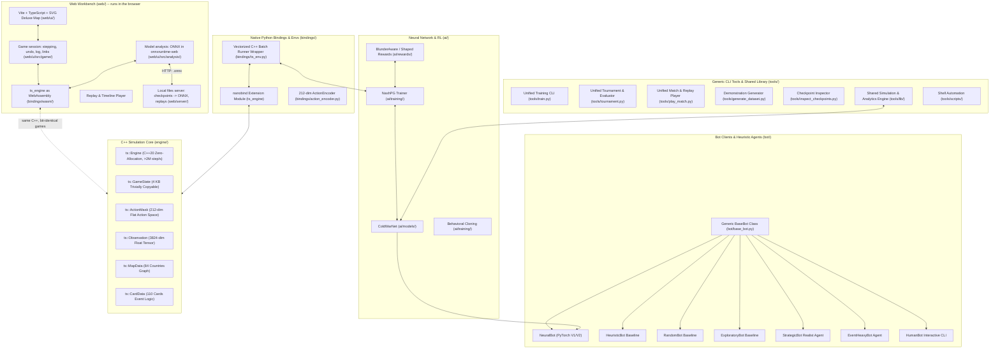
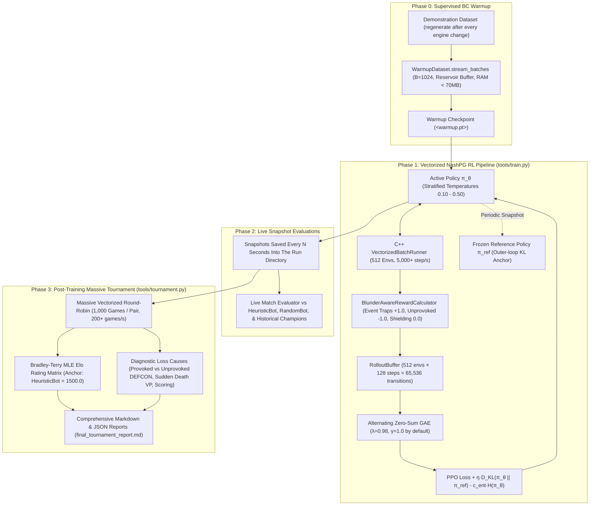

# Twilight Struggle AI: Project Guide & Agent Instructions

This repository contains the complete AI, simulation engine, web workbench, and training infrastructure for the Deluxe Edition of **Twilight Struggle** (110 Cards).

---

## 1. Project Architecture & Components



---

## 2. Directory Structure

```
.
├── CMakeLists.txt              # Minimal root CMake configuration (orchestrates engine & bindings)
├── .gitignore                  # Git ignore rules for build, venv, node, logs, and rules/
├── .python-version             # Python runtime version pinned for environment
├── pyrefly.toml / pytest.ini   # Static typing and test configuration
│
├── engine/                     # Core C++20 simulation engine (see engine/AGENTS.md)
│   ├── CMakeLists.txt          # Engine library, unit tests, fuzzer, benchmark targets
│   ├── AGENTS.md               # Specific instructions for maintaining the C++ engine
│   ├── include/ts/             # Public C++ headers (GameState, MicroAction, ActionMask, etc.)
│   ├── src/                    # Implementation files (scoring, ops, cards, state machine)
│   └── tests/                  # C++ test suites (ts_tests, ts_fuzz, ts_benchmark)
│
├── bindings/                   # Native Python bridge via nanobind & Python environment wrappers
│   ├── CMakeLists.txt          # nanobind module build configuration
│   ├── AGENTS.md               # Specific instructions for maintaining Python bindings
│   ├── ts_bindings.cpp         # nanobind module exporting ts_engine & VectorizedBatchRunner
│   ├── state_json.{hpp,cpp}    # display state + save as JSON, shared with the WebAssembly build
│   ├── selftest.hpp            # whole-game digest compiled into both builds (parity check)
│   ├── wasm/ts_engine_wasm.cpp # the engine's C API for the browser (Emscripten, build_web.sh)
│   ├── ts_engine/              # GENERATED stub package (__init__.pyi + one file per submodule)
│   ├── ts_engine.pyi.pattern   # Hand-written overrides the stub generator cannot introspect
│   ├── action_encoder.py       # 212-dim Flat Action <-> MicroAction bidirectional codec
│   └── ts_env.py               # Single & Vectorized batched C++ simulation wrapper
│
├── ai/                         # Neural Network, Training, Rewards & Evaluation Probes
│   ├── models/                 # Neural network architectures
│   │   ├── coldwar_net_v2.py   # ColdWarNetV2 -- the baseline (GNN GraphConv + card/country
│   │   │                       # cross-attention + global ResNet + masked heads); also
│   │   │                       # ColdWarNetMLP, selected by --arch mlp
│   │   ├── coldwar_net.py      # V1, kept because checkpoints predating V2 name it
│   │   └── coldwar_net_architecture.svg # Architecture diagram
│   ├── rewards/                # Perspective-aligned reward strategies
│   │   └── reward_calculator.py# BlunderAwareRewardCalculator, ZeroSumTerminalReward, ShapedZeroSumReward
│   ├── eval/                   # Evaluation probes: calibration, input ablation, behavioral
│   │                           # suite, human-corpus agreement, position diagnostics, ...
│   ├── search/pimcts.py        # Perfect-information MCTS, used for evaluation
│   └── training/               # Training pipelines & algorithms
│       ├── rollout_buffer.py   # Trajectory storage, GAE advantage calculator & value/advantage diagnostics
│       ├── behavioral_cloning.py # Phase 0 supervised pre-training
│       ├── nash_pg.py          # NashPG (Nash Policy Gradient with iterative KL regularization) + FixedEntropyProbe
│       ├── generic_trainer.py  # Shared supervised training loop
│       ├── warmup_dataset_loader.py # Memory-bounded demonstration streaming
│       ├── human_corpus_dataset.py  # Memory-mapped human-corpus sample loader
│       ├── start_pool.py       # Start-state pool for non-opening rollouts
│       └── train.py            # CLI training entry point (behind tools/train.py)
│
├── bot/                        # Bot clients & baseline heuristics (see bot/AGENTS.md)
│   ├── base_bot.py             # Generic BaseBot abstract class defining the bot interface
│   ├── neural_bot.py           # NeuralBot client using ColdWarNet checkpoints (V1/V2)
│   └── ...                     # random, heuristic, exploratory, strategic (DEFCON-2 containment),
│                               # event_heavy, and human (interactive CLI) baselines
│
├── deploy/web/                 # Dockerfile (+ compose, README) deploying the workbench from GitHub
│
├── web/                        # Web Workbench -- runs in the browser (see web/ui/AGENTS.md)
│   ├── ui/                     # Vite + TypeScript + SVG: the map, HUD, tracks, replay controls,
│   │                           # the game session (src/game), model analysis (src/analysis) and
│   │                           # the WebAssembly engine loader (src/engine)
│   └── server/                 # Local files server & replay writer (see web/server/AGENTS.md)
│       ├── main.py             # the page + /api/local/{info,models,replays}
│       ├── local_files.py      # checkpoint listing and on-demand ONNX export cache
│       ├── replay.py           # ReplayLogger and ReplayManager
│       └── replay_types.py     # TypedDict specifications for state, action, and logs
│
├── tools/                      # Reusable agent & developer CLI tools (see tools/README.md)
│   ├── README.md               # Tool descriptions, CLI flags, and usage examples
│   ├── train.py                # Unified RL training & fine-tuning runner
│   ├── tournament.py           # Unified tournament & head-to-head evaluator
│   ├── play_match.py           # Unified match runner & replay generator (.tslog.json)
│   ├── generate_dataset.py     # High-throughput vectorized demonstration generator (.jsonl.gz)
│   ├── build_human_dataset.py  # Human-corpus demonstration dataset builder
│   ├── inspect_checkpoints.py  # Checkpoint discovery, architecture detection & inspector
│   ├── download_ts_replayer.py # One-time fetch of the human game corpus (cached, throttled)
│   ├── behavioral_test.py      # Scripted behavioral probes against a checkpoint
│   ├── fetch_acts_corpus.py    # Fetch of the secondary (ACTS) game corpus
│   ├── scrape_card_strategies.py # Regenerates the local card strategy notes
│   ├── lib/                    # Reusable simulation, evaluation & analytics backend
│   │   ├── ts_replayer_parse.py   # The human log's grammar (entries, moves, rolls, reveals)
│   │   ├── ts_replayer_convert.py # Verified log -> engine decisions, entry by entry
│   │   ├── ts_replayer_hands.py   # Both hands for a whole game, solved as a z3 constraint problem
│   │   ├── corpus_paths.py     # Resolves where the human corpus is cached
│   │   ├── card_mappings.py    # Card name <-> id mapping shared by the corpus tools
│   │   ├── engine_fingerprint.py # Content hash of engine/ + bindings/, for staleness checks
│   │   ├── player_agent.py     # Unified Agent loader (random, heuristic, neural)
│   │   ├── tournament_evaluator.py # Matchup runner & loss cause classifier
│   │   ├── self_play.py        # Self-play simulation & .tslog.json recorder
│   │   ├── batch_tournament.py # Vectorized batch tournament runner & Bradley-Terry MLE
│   │   ├── scoring_formatter.py # Regional scoring audit calculation helper
│   │   └── checkpoint_utils.py # Checkpoint scanning and architecture detection
│   └── scripts/                # Shell automation scripts
│       ├── check_engine_fresh.sh   # Refuses to proceed against a stale build (see 3.2)
│       ├── train_and_tournament.sh # Unified training & tournament bash runner
│       ├── train_direct_rl.sh  # Direct RL self-play runner
│       ├── install_clang_userspace.sh  # clang without root (apt-get download + dpkg -x)
│       └── run_asan.sh         # runs a command against build_san with clang's ASan runtime
│
├── data/                       # [GIT IGNORED] Working artifacts: model checkpoints, saved
│                               # .tslog.json game logs, and demonstration datasets
│
├── external/                   # External integrations & differential engines
│   ├── README.md               # Integration guide
│   └── struggler/              # External reference engine (Python)
│
├── tests/                      # Python pytest suite, split by what's under test (see §5)
│   ├── conftest.py             # --run-fuzz option; ignores tests/differential at collection;
│   │                           # generated_replay_dir and corpus fixtures; stale-engine guard
│   ├── bindings/               # Binding-layer smoke tests only (the nanobind surface itself),
│   │                           # the replay JSON schema, the pyrefly run, the stale-.so guard
│   ├── engine_logic/           # Game-rule tests driven through the bindings (110 cards, headline
│   │                           # resolution, space race, coups, ...) -- migration debt: NEW engine
│   │                           # rule coverage belongs in engine/tests/*.cpp, not here
│   ├── replayer/               # tools/lib/ts_replayer_*.py conversion pipeline: one targeted file
│   │                           # per human-replay-corpus mismatch, plus the log-grammar tests
│   ├── training/               # RL/reward/eval stack: NashPG, credit assignment, GAE, PIMCTS, ...
│   ├── web/                    # Server, bot-client, and Playwright browser E2E tests
│   └── differential/           # Cross-engine fuzzing vs external/struggler -- WIP/unstable, gated
│                               # behind the differential_fuzz marker / --run-fuzz, not run by
│                               # default (BUGS.md TEST-1)
│
├── rules/                      # Formal spec the engine implements (tracked, except the PDF)
│   ├── Rules_Final.pdf         # [GIT IGNORED] Official rulebook -- GMT Games copyright, not ours to commit
│   ├── rules.md / rules.json   # Formal mathematical rules specification
│   ├── cards.json              # 110-card metadata, bundled into the web UI (web/ui/src/metadata.ts)
│   ├── flags.json              # 43 persistent continuous effect & state bits
│   └── map.json / map.md       # 84-country graph topology & coordinates
│
└── build/                      # Build outputs (.gitignored)
    ├── release/                # Standard release CMake build
    └── asan/                   # AddressSanitizer / UBSan debug build
```

---

## 3. Developer & Agent Workflows

### 3.1 Initial Environment Setup
```bash
# 1. Python virtual environment -- requirements.txt is the source of truth for dependencies
python3 -m venv .venv
source .venv/bin/activate
pip install -r requirements.txt

# 2. Web UI dependencies & production build
cd web/ui && npm install && npm run build && cd ../..
```

Three requirements are optional and degrade rather than break: `z3-solver` (without it the human-log
converter falls back to per-turn heuristics and no longer reproduces the corpus), `tensorboard` (the
trainer still writes `training_metrics.jsonl`), and `playwright` (needed only by the browser E2E
tests, together with `python -m playwright install chromium`). For a CUDA build of PyTorch, install
`torch` from pytorch.org first; the rest installs on top of it.

### 3.2 Build C++ Engine & Nanobind Extension
```bash
# Needs clang (apt-get install clang; without root: tools/scripts/install_clang_userspace.sh)
# Standard Release Build
cmake -B build/release -S . -DPython_EXECUTABLE=$(pwd)/.venv/bin/python3
cmake --build build/release -j
```

The engine is built with **clang**: the root `CMakeLists.txt` finds it and refuses any other
compiler, and `tools/scripts/check_engine_fresh.sh` reconfigures a build directory created under
GCC. The batch runner calls GCC's libgomp directly so it shares torch's OpenMP pool under clang
(`bindings/AGENTS.md` §3); `tests/bindings/test_build_toolchain.py` guards both.

`cmake --build` produces `build/release/ts_engine.cpython-*.so`, which is what
`PYTHONPATH=.:build/release` imports as `ts_engine`. Note the output path: the module lands in
the **binary root**, not in `build/release/bindings/`, which holds only intermediate objects.

**Before any experiment, check the build is not stale** (invariant 13):

```bash
tools/scripts/check_engine_fresh.sh && PYTHONPATH=.:build/release .venv/bin/python tools/train.py ...
```

The script hashes the `engine/` and `bindings/` sources and compares that against the stamp it
wrote next to the built module. It exits 0 when they match, and rebuilds and exits **1** when
they do not — so a chained command stops rather than running against yesterday's rules. It
hashes content instead of comparing timestamps because checking out a branch rewrites mtimes
without changing anything, which would report staleness on every switch.

### 3.3 Generic Scheme for Training & Tournament Pipelines



#### Standard Execution Commands

Checkpoints and datasets are working artifacts under the git-ignored `data/` tree; the
placeholders stand for whichever ones you are using.

```bash
# 1. Phase 0: Bounded Streaming BC Warmup (5,000 games in ~3 minutes, <70 MB RAM)
TRITON_CACHE_DIR=.triton_cache PYTHONPATH=. .venv/bin/python tools/train.py \
  --mode warmup \
  --arch v2 \
  --warmup-dataset <dataset.jsonl.gz> \
  --bc-epochs 2 \
  --batch-size 1024 \
  --output-dir <warmup.pt>

# 2. Phase 1 & 2 & 3: Unified RL Training + Live Snapshots + Post-Training Tournament
# (or simply use ./tools/scripts/train_and_tournament.sh v2 160000000 10000000 <warmup.pt>)
TRITON_CACHE_DIR=.triton_cache PYTHONPATH=. .venv/bin/python tools/train.py \
  --arch v2 \
  --train-steps 160000000 \
  --snapshot-every-steps 10000000 \
  --warmup-checkpoint <warmup.pt> \
  --reward-scheme blunder_aware \
  --eval-opponents heuristic random <checkpoint.pt> \
  --eval-games-per-side 50 \
  --post-tournament \
  --post-tournament-models heuristic random <checkpoint.pt> \
  --post-tournament-games 500

# 2a. A/B experiments. Every budget is in env steps -- there is no wall-clock flag, because
#     steps/sec depends on the policy and a time budget hands the two arms different amounts
#     of training. Give both arms the same --train-steps AND the same --pool-every-steps:
#     it sets how fast the self-play opponent pool grows, so two arms that differ in it face
#     different opponents and differ in two factors. --snapshot-every-steps (10M) is reporting
#     only: evaluation restores the RNG streams it draws from, so it does not change training.
#     --eval-max-snapshot-opponents bounds evaluation, which is otherwise quadratic in run
#     length.
TRITON_CACHE_DIR=.triton_cache PYTHONPATH=. .venv/bin/python tools/train.py \
  --arch v2 --train-steps 60000000 --eval-max-snapshot-opponents 4 \
  --output-dir <run-dir> --start-pool-frac 1.0

# 2b. Watch a live (or finished) run: every training_metrics.jsonl metric is mirrored to
#     <output-dir>/tb as TensorBoard event files. Pass --no-tensorboard to write JSONL only.
.venv/bin/python -m tensorboard.main --logdir <run-dir>/tb

# 3. Standalone Post-Tournament & Elo Evaluation Across Any Checkpoint Directory
PYTHONPATH=. .venv/bin/python tools/tournament.py \
  --checkpoint-dir <run-dir> \
  --games-per-side 500 \
  --anchor-model HeuristicBot \
  --anchor-elo 1500.0 \
  --output-report <run-dir>/tournament_report.md
```

### 3.4 Launch the Web Workbench
```bash
# 1. Build the page and its WebAssembly engine (needs Emscripten: tools/scripts/install_emsdk.sh).
#    Rebuild after any engine change -- the page runs its own copy of the engine.
tools/scripts/build_web.sh

# 2. Serve it, with this machine's checkpoints and replays
PYTHONPATH=.:build/release .venv/bin/python -m web.server.main --port 8000

# 3. Open http://localhost:8000/
```

The workbench serves three purposes, all in the page:

* **Watch replays** -- the local server's list, *Load Replay*, or drop a `.tslog.json` on the page.
  A traced replay shows the model's probabilities and critic at every step.
* **Test the engine by playing it** -- click any move for either side; the HUD's die selector forces
  rolls, *Debug Tools* sets influence, DEFCON and VP (undoable), *Export Replay* saves the game.
* **Play with a model** -- in *Model Analysis* pick a local checkpoint (exported to ONNX on first
  use, `tools/export_onnx.py`), a Hugging Face repo's `.onnx`, or drop an `.onnx` file. Every
  position then shows its probability on each card, button and country plus its critic for both
  sides; *★ Play favourite* (or `F`) plays its argmax in the model's own action view, and
  *Auto-play* (none / USSR / US) makes that side play by itself.

The address bar always carries `pos` (the position itself), `model` and `auto`, updated with
`replaceState`, so copying it shares the exact board. The engine badge shows the page engine's
fingerprint and turns **STALE** when the local sources have moved on from the build the page loaded.

**Deployment:** GitHub Pages publishes the page with no server (`.github/workflows/pages.yml`);
`deploy/web/Dockerfile` builds page, engine and local server from the GitHub repository with
checkpoints mounted at `/data/checkpoints`. See `deploy/web/README.md`.

### 3.5 Reusable Agent CLI Tools (`tools/`)

#### Standard CLI Tools (`tools/`)
1. **Unified Training Runner (`tools/train.py`)**:
   Starts time-bounded RL with live snapshot tournaments, blunder-aware reward shielding, and optional post-training massive tournament benchmarking.
2. **Unified Tournament & Evaluator (`tools/tournament.py`)**:
   Runs ultra-fast parallel tournaments and matchups (300-800 games/sec). If passed 2 models, outputs a granular head-to-head report with loss causes; if passed multiple models or a directory, outputs the full round-robin leaderboard and Bradley-Terry Elo matrix.
3. **Unified Match Runner & Replay Generator (`tools/play_match.py`)**:
   Runs matches between any pair of agents (supporting distinct checkpoints, heuristics, interactive human CLI play via `--us human`, and commentary), saving standardized `.tslog.json` replays with direct Web Workbench viewer URLs.
4. **Demonstration Dataset Builders (`tools/generate_dataset.py`, `tools/build_human_dataset.py`)**:
   The first runs thousands of games in parallel across hundreds of C++ environments on
   multi-temperature schedules, dumping compressed `.jsonl.gz` for supervised BC warmup; the
   second builds the same kind of dataset from the converted human corpus. Both must be rebuilt
   after an engine change.
5. **Checkpoint Registry Inspector (`tools/inspect_checkpoints.py`)**:
   Scans the checkpoint tree under `data/` and displays all saved models, sizes, timestamps, and the architecture detected from the weights.
6. **Human Game Corpus (`tools/download_ts_replayer.py` + `tools/lib/ts_replayer_*.py`)**:
   Downloads community-uploaded human games from ts-replayer.fly.dev and converts them into
   engine decisions. The conversion is verified rather than parsed: each entry is rebuilt from
   the position the log states, driven through the engine, and its outcome compared against the
   log's own next board. The hands, which the log never states in full, are solved for a whole
   game at once as a constraint problem (z3, MIT-licensed and optional). Every game in the
   corpus converts in full; `tools/README.md` §6 has the current entry and decision counts.
7. **Behavioral Probes (`tools/behavioral_test.py`)**:
   Runs scripted positions against a checkpoint and reports what it chose.

---

## 4. Key Maintenance Invariants for Agents

1. **Zero Heap Allocations in Engine Core**:
   `ts::GameState` must remain trivially copyable (`std::is_trivially_copyable_v<GameState>`) and within 4 KB.
2. **212-Dimensional Flat Action Space**:
   All neural network policy heads and action masks operate over the exact 212 flat action space mapped by `bindings.ActionEncoder` and `ActionMask::generate_flat_mask_212`.
3. **NashPG Reference Regularization**:
   The active policy $\pi_\theta$ is regularized against the frozen outer-loop snapshot $\pi_{\text{ref}}^{(k)}$ with fixed $\eta$, ensuring monotonic convergence to Nash equilibrium without strategy cycling.
4. **Deterministic PRNG**:
   All simulation randomness uses `state.rng_state` with SplitMix64 (`ts::Prng`).
5. **Strict Type Annotations & Mandatory Type Checking**:
   All Python types must be explicitly annotated (using `TypedDict` definitions in `web/server/replay_types.py` for all serialized JSON structures, replays, game states, audit logs, and metrics). Whenever modifying or adding Python code, static type checks MUST be executed via `.venv/bin/pyrefly check` and all typing validation tests must pass cleanly without errors.
6. **Unified Self-Play & Replay Generation**:
   All self-play simulation and `.tslog.json` replay recording across training pipelines, evaluation benchmarks, and CLI scripts MUST use the unified `generate_self_play_replay` function in `tools.lib.self_play` to guarantee 100% adherence to standard `.tslog.json` schema (`ReplayLogDict`).
   Each step may also carry a **trace** — `policy` (the distribution the move was drawn from,
   at the node *before* it) and `critic` (both value heads from both perspectives on the state
   *after* it) — produced by `ai/eval/policy_readout.py` and described in
   `web/server/AGENTS.md`. Two rules hold whatever writes it: **recording a belief must not
   change what is played** (`read_policy` consumes the torch RNG exactly as `sample_action`
   does, pinned by `tests/training/test_policy_readout.py`; `tests/training/test_replay_trace.py`
   checks the whole game), and **every reader treats the blocks as optional**.
7. **Mandatory Checkpoint Directory Naming Convention**:
   A run's checkpoint directory MUST be named from its short name — `<engine>-<attempt>-<seed>`
   — plus the start date and time. Pass `tools/train.py --run-name <engine>-<attempt>-<seed>`
   and the directory is built for you, with the name also recorded in `metadata.json`. Omit any
   step count: one directory holds every budget of a lineage, and each snapshot's filename
   already carries its own. A `run_<version>_<date>_<time>` form remains the fallback for smoke
   runs that are not part of a lineage. Hardcoded, ad-hoc names are forbidden — they say nothing
   about which engine or seed produced the run, which is exactly what a later comparison needs.
8. **Bounded Dataset Streaming & OOM Prevention**:
   Any operation reading or training on demonstration datasets (`WarmupDataset`) MUST use bounded streaming (`stream_batches` / `stream_transitions`). Loading entire multi-million transition datasets into monolithic in-memory tensors without bounds is forbidden to prevent system Out-Of-Memory (OOM) failures.
9. **Mandatory Unified CLI Invariant — No Ad-Hoc Scripts**:
   Agents must NEVER write ad-hoc Python scripts, scratch files, or one-off code to call Behavioral Cloning (`ai/training/behavioral_cloning.py`), train neural models, run tournaments, or simulate matches.
   - For all model training (both Behavioral Cloning warmup and RL self-play): **ALWAYS execute `tools/train.py`** (`tools/train.py --mode warmup --warmup-dataset <path>` for BC warmup, or `tools/train.py --warmup-dataset <path>` for BC warmup + RL self-play).
   - For all tournaments and evaluations: **ALWAYS execute `tools/tournament.py`**.
   - For all match simulation and replays: **ALWAYS execute `tools/play_match.py`**.
   Writing one-off scripts to invoke training or simulation functions directly violates repository architecture.
10. **Pre-Training Commit & Checkpoint Metadata Invariant**:
   Before launching any model training run:
   - A git commit MUST be created recording the current codebase state (commit locally on the active branch without pushing or advancing remote master).
   - The commit hash, training mode, and a short description of what was changed and the training goal MUST be recorded in the run directory's `metadata.json`. The training CLI (`tools/train.py --description "..."`) records these fields at startup.
11. **Engine Change Restriction Invariant**:
   Agents must **NEVER make any changes to the C++ engine (`engine/`) without explicitly asking the user and obtaining prior confirmation**. Every engine modification requires prior user approval without exception.
12. **Human Replay Conversion Is Never Approximated**:
   The ts-replayer corpus is training data for a model meant to learn how people play, so a
   decision the log does not determine must NEVER be invented, defaulted, or filled in by a
   heuristic — it is a failure to diagnose and fix. The same goes for the engine: report a
   "safety net" fallback rather than relying on one, and fail loudly instead of recovering an
   approximation. Two exceptions exist, both explicitly approved and both narrow: guessing the
   cards Our Man in Tehran looks at, and the individually diagnosed entries in
   `_KNOWN_SCORE` / `_LOG_MISCOUNTED` / `_INVALID_PLAYS` where the log itself is wrong. When
   reporting a conversion mismatch, cite the exact replay, turn and action round — and per the
   engine-change invariant above, propose engine fixes rather than making them.

13. **Never Measure Against A Stale Engine**:
   Every artifact in this repository — a checkpoint, a demonstration dataset, an Elo anchor, a
   diagnostic table, a converted replay — is only meaningful relative to the engine that
   produced it, and rebuilding the engine can change the decision stream without a line of
   Python changing. Run `tools/scripts/check_engine_fresh.sh` before generating or consuming
   any of them, and when it reports the build was stale, treat every number taken beforehand as
   measured on a different game until it is re-taken.
   Two failure modes make this worse than it sounds, and both have already happened here:
   - Datasets in the `(seed, [flat_action, ...])` format do not fail when the engine moves under
     them. `WarmupDataset.stream_transitions` stops a game at the first newly-illegal action and
     continues to the next, so the set silently shrinks — and always by losing the *tail* of
     each game, which biases what remains toward openings.
   - Checkpoints keep loading. Old weights still accept the current observation and run a
     forward pass, so nothing announces that they were trained against different rules. Loading
     cleanly is not evidence of comparability.


### Test data that is not in the repository

The replay and checkpoint trees under `data/` are git-ignored, so **no test may assume either
holds anything**. Do not guard such a test with a skip: a check that skips when its input is
missing passes on every machine while verifying nothing, which is this repository's most repeated
bug — it has also taken the form of a `pyrefly` invocation checking zero files and a stale-engine
test disabled for two commits by a directory move.

Use the `generated_replay_dir` fixture in `tests/conftest.py` instead. It generates a replay with
`generate_self_play_replay` into a temporary directory and points the server at it through
`TS_REPLAYS_DIR`, so the test runs against real output of the current writer. It needs no
checkpoint — the generator falls back to an untrained network — and costs about a second. That
beats committing a sample replay, which is megabytes and can drift from what the writer emits
while the test keeps passing.

Generated data cannot catch a change to the schema itself, since the writer and the TypedDicts
move together. That is what `tests/bindings/replay_schema.golden.json` is for — the schema pinned
as source, a few KB, reviewable as a diff. Regenerate it deliberately when the schema changes:

```bash
PYTHONPATH=.:build/release .venv/bin/python tests/bindings/test_replay_schema_golden.py
```

To get real replays for the workbench during development, generate them; they are not repo content:

```bash
PYTHONPATH=. .venv/bin/python tools/play_match.py --us heuristic --ussr strategic --game-id scratch
```

---

## 5. Run Test Suites

`tests/` is split by what is under test, and **the groups are not all relevant to every change.**
Pick by what you touched; the table is the whole rule.

| you changed | run | cost |
|:---|:---|---:|
| `engine/`, `bindings/` | C++ suite + `tests/bindings tests/engine_logic` | ~30s |
| `tools/lib/ts_replayer_*` | the above + `tests/replayer` | ~6.5 min |
| `ai/`, `bot/`, `tools/` | the above + `tests/training` | ~7 min |
| `web/server/`, `web/ui/` | **also** `tests/web` (see prerequisites) | ~40s |

**Do not run the whole of `tests/web` for AI or tools changes.** It cannot tell you anything
about them, and it fails for reasons that have nothing to do with your change: the frontend tests
need `web/ui/dist` built (`tools/scripts/build_web.sh`) and the E2E tests need a Playwright browser
installed, neither of which is in the repository. The exception is an engine or bindings change:
the workbench runs the engine as WebAssembly, and `tests/web/test_wasm_engine.py` (after
`tools/scripts/build_web.sh --engine`) is what proves that build still plays the native games.

### The ts-replayer corpus

`tests/replayer` (and a few tests in `tests/engine_logic`) run against the **real** human corpus,
not synthetic data — that is the point of them, so it cannot be generated. It is ~5 MB,
git-ignored, and downloaded once per **machine**:

```bash
PYTHONPATH=.:build/release .venv/bin/python tools/download_ts_replayer.py
```

It is stored in `datasets/ts_replayer` in the **shared data tree** — the main checkout's `data/`,
which `tools/lib/data_root.py` finds from git even inside a worktree — so every checkout and every
git worktree shares one copy instead of re-fetching 300 throttled requests for bytes already on the
machine. `tools/lib/corpus_paths.py` resolves the location: `$TS_REPLAYER_CORPUS` first, then the
shared data tree. **A missing corpus fails these tests; it does not skip them** — a
`skipif` would turn the whole group green on every machine that does not have it, which is the
opposite of what these tests are for.

### Run the suite in parallel

`pytest-xdist` is installed; `-n auto` uses every core and takes the backend suite from minutes to
about a minute. It is worth it everywhere.

The single whole-corpus test, `test_every_game_in_the_corpus_converts`, is marked `corpus_full`
and **deselected by default** — on its own it dominated the runtime of `tests/replayer`. Run it
before merging any change to `tools/lib/ts_replayer_*`:

```bash
PYTHONPATH=. .venv/bin/python -m pytest -q -m corpus_full tests/replayer
```

A `converted_game` session fixture in `tests/conftest.py` memoizes `convert_game` by replay id
for tests that want it — available rather than mandatory, since under `-n auto` it would buy
little for the churn of rewriting existing call sites.

```bash
# ---------------------------------------------------------------------------------------------
# 0. ALWAYS FIRST -- never measure against a stale engine (invariant 13)
# ---------------------------------------------------------------------------------------------
tools/scripts/check_engine_fresh.sh

# ---------------------------------------------------------------------------------------------
# 1. C++ ENGINE -- the fast inner loop for engine/ work (seconds)
# ---------------------------------------------------------------------------------------------
./build/release/engine/ts_tests
./build/release/engine/ts_benchmark
./build/release/engine/ts_fuzz --games 10000            # invariant fuzzer
./build/release/engine/ts_fuzz --steps 5000000 --seed 42

# ---------------------------------------------------------------------------------------------
# 2. BACKEND PYTHON -- everything except the web UI. The default suite for engine, bindings,
#    replayer, AI and tools work. ~7 minutes, dominated by tests/replayer.
# ---------------------------------------------------------------------------------------------
PYTHONPATH=. .venv/bin/python -m pytest -q -n auto tests/bindings tests/engine_logic tests/replayer tests/training

#    Narrower loops while iterating (run the full backend suite before calling the work done):
PYTHONPATH=. .venv/bin/python -m pytest -q tests/bindings tests/engine_logic
PYTHONPATH=. .venv/bin/python -m pytest -q tests/replayer
PYTHONPATH=. .venv/bin/python -m pytest -q tests/training
PYTHONPATH=. .venv/bin/python -m pytest -q tests/engine_logic/test_all_110_cards.py::TestName::test_case

# ---------------------------------------------------------------------------------------------
# 3. WEB / UI -- ONLY for changes under web/. Needs two build artifacts that are not committed:
# ---------------------------------------------------------------------------------------------
cd web/ui && npm install && npm run build && cd ../..   # produces web/ui/dist
.venv/bin/python -m playwright install chromium         # for the E2E tests
PYTHONPATH=. .venv/bin/python -m pytest -q tests/web

# ---------------------------------------------------------------------------------------------
# 4. STATIC TYPING -- after ANY Python change, must be 0 errors (invariant 5)
# ---------------------------------------------------------------------------------------------
.venv/bin/pyrefly check ai tools tests web bindings
```

> **Invoke pytest as `python -m pytest`**, not via the `.venv/bin/pytest` console script: that
> script carries an absolute shebang from wherever the venv was first created, which breaks if the
> venv or the repository is ever moved or copied. For the same reason, use the path of whichever
> checkout actually holds `.venv/` — it is not necessarily the directory you are working in.

**Pass pyrefly the source directories explicitly.** pyrefly honours `.git/info/exclude`, so in a
checkout whose exclude file covers the working directory a bare `pyrefly check` matches ZERO files
and exits 0 having examined nothing. `No Python files matched patterns` on the last line means the
check measured nothing, not that the code is clean.

**Do NOT run `tests/differential/`.** It is gated behind the `differential_fuzz` marker /
`--run-fuzz` and is ignored at collection (`tests/conftest.py`), because those modules fail at
*import* and would otherwise abort the whole run. It is WIP and not part of the check a change is
expected to pass — tracked as TEST-1 in `BUGS.md`. Do not spend time reviving it.

---

## 6. Keep Documentation Synchronized

`engine/AGENTS.md`, `bindings/AGENTS.md`, `bot/AGENTS.md` and `web/server/AGENTS.md` each require
their own file **and this one** to be updated when behavior in that directory changes; this file
carries the same duty in reverse. A change that alters an interface, an invariant, a CLI flag or a
directory's contents is not finished until the documentation covering it says so in the same
change — and `README.md` and `CLAUDE.md` are published, so what they claim must be true of the
code as it stands, with experiment history and private artifacts left out.
