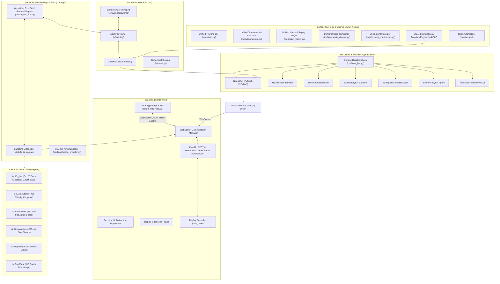
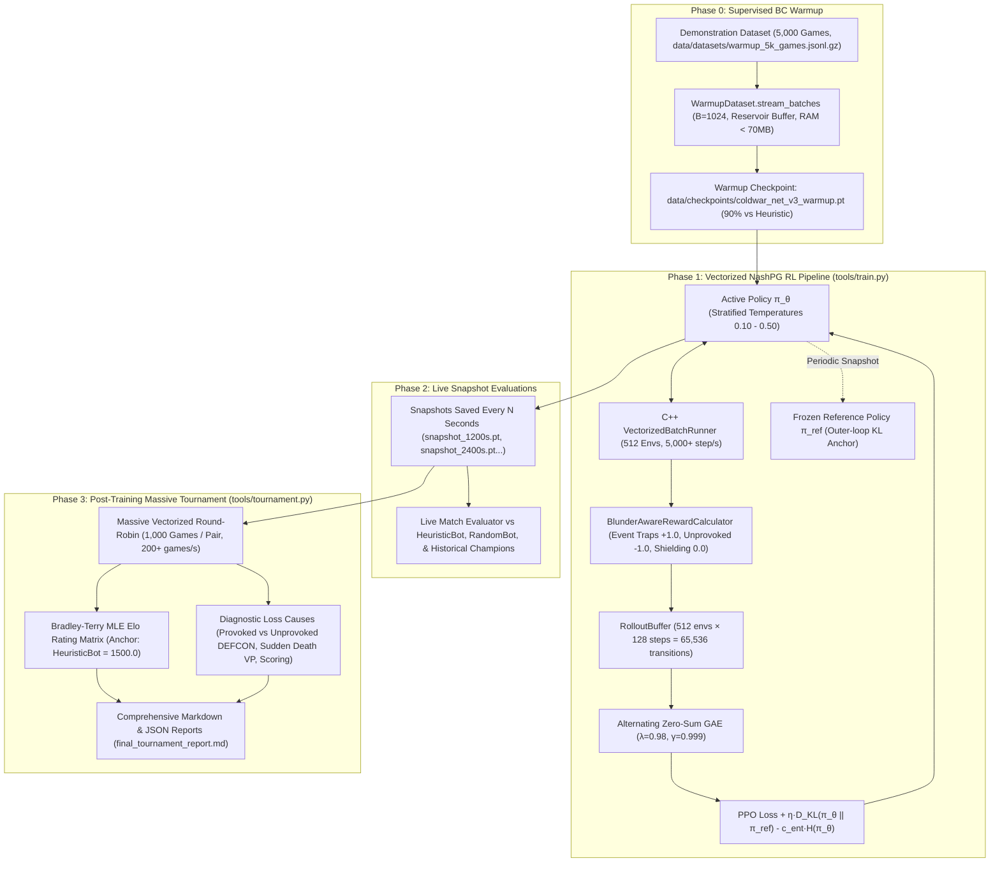

# Twilight Struggle AI: Project Guide & Agent Instructions

This repository contains the complete AI, simulation engine, web workbench, and training infrastructure for the Deluxe Edition of **Twilight Struggle** (110 Cards).

---

## 1. Project Architecture & Components



---

## 2. Directory Structure

```
.
├── CMakeLists.txt              # Minimal root CMake configuration (orchestrates engine & bindings)
├── .gitignore                  # Git ignore rules for build, venv, node, logs, and rules/
├── .python-version             # Python runtime version pinned for environment
├── pyrefly.toml / pytest.ini   # Static typing and test configuration
│
├── engine/                     # Core C++20 simulation engine (see engine/AGENTS.md)
│   ├── CMakeLists.txt          # Engine library, unit tests, fuzzer, benchmark targets
│   ├── AGENTS.md               # Specific instructions for maintaining the C++ engine
│   ├── include/ts/             # Public C++ headers (GameState, MicroAction, ActionMask, etc.)
│   ├── src/                    # Implementation files (scoring, ops, cards, state machine)
│   └── tests/                  # C++ test suites (ts_tests, ts_fuzz, ts_benchmark)
│
├── bindings/                   # Native Python bridge via nanobind & Python environment wrappers
│   ├── CMakeLists.txt          # nanobind module build configuration
│   ├── AGENTS.md               # Specific instructions for maintaining Python bindings
│   ├── ts_bindings.cpp         # nanobind module exporting ts_engine & VectorizedBatchRunner
│   ├── ts_engine.pyi           # Python type stubs for IDE and static typing
│   ├── action_encoder.py       # 212-dim Flat Action <-> MicroAction bidirectional codec
│   └── ts_env.py               # Single & Vectorized batched C++ simulation wrapper
│
├── ai/                         # Neural Network, Training & Reward Strategy (ai/AGENTS.md)
│   ├── models/                 # Neural network architectures
│   │   ├── coldwar_net.py      # ColdWarNet (GNN GraphConv + Card + Global ResNet + Masked Heads)
│   │   └── coldwar_net_architecture.svg # Architecture diagram
│   ├── rewards/                # Perspective-aligned reward strategies
│   │   └── reward_calculator.py# BlunderAwareRewardCalculator, ZeroSumTerminalReward, ShapedZeroSumReward
│   └── training/               # Training pipelines & algorithms
│       ├── rollout_buffer.py   # Trajectory storage, GAE advantage calculator & value/advantage diagnostics
│       ├── behavioral_cloning.py # Phase 0 supervised pre-training
│       ├── nash_pg.py          # NashPG (Nash Policy Gradient with iterative KL regularization) + FixedEntropyProbe
│       ├── warmup_dataset_loader.py # Memory-bounded demonstration streaming
│       └── train.py            # CLI training entry point
│
├── bot/                        # Bot clients & baseline heuristics (see bot/AGENTS.md)
│   ├── AGENTS.md               # Specific instructions for developing AI bots
│   ├── base_bot.py             # Generic BaseBot abstract class defining bot interface
│   ├── random_bot.py           # RandomBot baseline
│   ├── heuristic_bot.py        # HeuristicBot rule-based baseline
│   ├── neural_bot.py           # NeuralBot client using ColdWarNet checkpoints (V1/V2/V3)
│   ├── exploratory_bot.py      # ExploratoryBot diverse exploration agent
│   ├── strategic_bot.py        # StrategicBot DEFCON-2 containment & commentary agent
│   ├── event_heavy_bot.py      # EventHeavyBot event-prioritizing agent
│   └── human_bot.py            # HumanBot interactive CLI terminal player
│
├── web/                        # Web Workbench (UI + Backend Server + Bot Client)
│   ├── bot_client.py           # WebSocket network bot runner for browser matches
│   ├── ui/                     # Vite + TypeScript + SVG Deluxe Map
│   │   ├── index.html
│   │   ├── package.json / vite.config.ts
│   │   └── src/                # Map view, HUD, tracks, debug panel, replay controls
│   └── server/                 # FastAPI Game Server and Replay Manager
│       ├── AGENTS.md           # Instructions for server maintainers
│       ├── main.py             # FastAPI app, REST routes, WebSocket endpoint /ws/game/{id}
│       ├── session.py          # GameSession class, action router, state broadcasting
│       ├── replay.py           # ReplayLogger and ReplayManager
│       └── replay_types.py     # TypedDict specifications for state, action, and logs
│
├── tools/                      # Reusable agent & developer CLI tools (see tools/README.md)
│   ├── README.md               # Tool descriptions, CLI flags, and usage examples
│   ├── train.py                # Unified RL training & fine-tuning runner
│   ├── tournament.py           # Unified tournament & head-to-head evaluator
│   ├── play_match.py           # Unified match runner & replay generator (.tslog.json)
│   ├── generate_dataset.py     # High-throughput vectorized demonstration generator (.jsonl.gz)
│   ├── inspect_checkpoints.py  # Checkpoint discovery, architecture detection & inspector
│   ├── download_ts_replayer.py # One-time fetch of the human game corpus (cached, throttled)
│   ├── lib/                    # Reusable simulation, evaluation & analytics backend
│   │   ├── ts_replayer_parse.py   # The human log's grammar (entries, moves, rolls, reveals)
│   │   ├── ts_replayer_convert.py # Verified log -> engine decisions, entry by entry
│   │   ├── ts_replayer_hands.py   # Both hands for a whole game, solved as a z3 constraint problem
│   │   ├── player_agent.py     # Unified Agent loader (random, heuristic, neural)
│   │   ├── tournament_evaluator.py # Matchup runner & loss cause classifier
│   │   ├── self_play.py        # Self-play simulation & .tslog.json recorder
│   │   ├── batch_tournament.py # Vectorized batch tournament runner & Bradley-Terry MLE
│   │   ├── scoring_formatter.py # Regional scoring audit calculation helper
│   │   └── checkpoint_utils.py # Checkpoint scanning and architecture detection
│   └── scripts/                # Shell automation scripts
│       ├── train_and_tournament.sh # Unified training & tournament bash runner
│       ├── train_direct_rl.sh  # Direct RL self-play runner
│       └── run_asan.sh         # AddressSanitizer execution script
│
├── data/                       # Datasets, Checkpoints & Recorded Replays
│   ├── checkpoints/            # Model weights (run_v3_*, coldwar_net_v3_warmup.pt)
│   ├── replays/                # Saved game logs (*.tslog.json)
│   └── datasets/               # Demonstration datasets (warmup_5k_games.jsonl.gz)
│
├── external/                   # External integrations & differential engines
│   ├── README.md               # Integration guide
│   └── struggler/              # External reference engine (Rust/Python)
│
├── tests/                      # Python pytest integration test suite (373 tests)
│   ├── test_credit_assignment.py # Unit tests for reward propagation & Rule 4.3 headlines
│   ├── test_neural_and_nashpg.py # Unit & integration tests for ColdWarNet, ActionMask, NashPG
│   ├── test_all_110_cards.py   # Comprehensive unit tests for all 110 cards
│   ├── test_all_110_cards_differential.py # Exhaustive 110-card cross-engine validation (131 tests)
│   ├── test_struggler_differential.py # Cross-engine differential test suite
│   ├── test_card_fixes.py      # Dedicated verification suite for card rules fixes
│   ├── test_bindings.py        # Validates Python nanobind module
│   ├── test_server_and_bot.py  # Validates REST APIs, bot-vs-bot WebSocket simulation
│   ├── test_types_and_json_schemas.py # Validates replay JSON schema and pyrefly typing
│   ├── test_web_workbench.py   # FastAPI client and UI metadata endpoint tests
│   └── test_e2e_space_race.py  # Playwright E2E browser tests
│
├── rules/                      # [GIT IGNORED] General game rules, PDF, map & card descriptions
│   ├── Rules_Final.pdf         # Official Twilight Struggle Deluxe Edition rulebook
│   ├── rules.md / rules.json   # Formal mathematical rules specification
│   ├── cards.json / primitives # 110 cards metadata and state machine primitives
│   ├── flags.json              # 47 persistent continuous effect & state bits
│   └── map.json / map.md       # 84-country graph topology & coordinates
│
└── build/                      # Build outputs (.gitignored)
    ├── release/                # Standard release CMake build
    └── asan/                   # AddressSanitizer / UBSan debug build
```

---

## 3. Developer & Agent Workflows

### 3.1 Initial Environment Setup
```bash
# 1. Python virtual environment
python3 -m venv .venv
source .venv/bin/activate
pip install nanobind fastapi "uvicorn[standard]" websockets pytest numpy pydantic httpx torch torchvision

# 2. Web UI dependencies & production build
cd web/ui && npm install && npm run build && cd ../..
```

### 3.2 Build C++ Engine & Nanobind Extension
```bash
# Standard Release Build
cmake -B build/release -S . -DPython_EXECUTABLE=$(pwd)/.venv/bin/python3
cmake --build build/release -j
```

### 3.3 Generic Scheme for Training & Tournament Pipelines



#### Standard Execution Commands
```bash
# 1. Phase 0: Bounded Streaming BC Warmup (Full 5,000 games in ~3 minutes, <70 MB RAM)
TRITON_CACHE_DIR=.triton_cache PYTHONPATH=. .venv/bin/python tools/train.py \
  --mode warmup \
  --arch v3 \
  --warmup-dataset data/datasets/warmup_5k_games.jsonl.gz \
  --bc-epochs 2 \
  --batch-size 1024 \
  --output-dir data/checkpoints/coldwar_net_v3_warmup.pt

# 2. Phase 1 & 2 & 3: Unified RL Training + Live Snapshots + Post-Training Tournament
# (or simply use ./tools/scripts/train_and_tournament.sh v3 7200 1200 data/checkpoints/coldwar_net_v3_warmup.pt)
TRITON_CACHE_DIR=.triton_cache PYTHONPATH=. .venv/bin/python tools/train.py \
  --arch v3 \
  --duration-seconds 7200 \
  --snapshot-interval-seconds 1200 \
  --warmup-checkpoint data/checkpoints/coldwar_net_v3_warmup.pt \
  --reward-scheme blunder_aware \
  --eval-opponents heuristic random data/checkpoints/run_v2_blunder_aware_9h/snapshot_21601s.pt \
  --eval-games-per-side 50 \
  --post-tournament \
  --post-tournament-models heuristic random data/checkpoints/run_v2_blunder_aware_9h/snapshot_21601s.pt \
  --post-tournament-games 500

# 2a. A/B experiments: budget by steps, not by wall clock. Evaluation cost scales with how
#     long the policy's games run, so a time budget hands the two arms different amounts of
#     training (one real 3-hour A/B finished 1024 vs 473 iterations on identical settings).
#     --duration-seconds now counts training only; evaluation and pool refreshes are excluded.
#     --eval-max-snapshot-opponents bounds evaluation, which is otherwise quadratic in run length.
TRITON_CACHE_DIR=.triton_cache PYTHONPATH=. .venv/bin/python tools/train.py \
  --arch v2 --train-steps 60000000 --eval-max-snapshot-opponents 4 \
  --output-dir data/checkpoints/ab_arm_on --start-pool-frac 1.0

# 2b. Watch a live (or finished) run: every training_metrics.jsonl metric is mirrored to
#     <output-dir>/tb/ as TensorBoard event files. Pass --no-tensorboard to write JSONL only.
.venv/bin/python -m tensorboard.main --logdir data/checkpoints/run_v3_<timestamp>/tb

# 3. Standalone Post-Tournament & Elo Evaluation Across Any Checkpoint Directory
PYTHONPATH=. .venv/bin/python tools/tournament.py \
  --checkpoint-dir data/checkpoints/run_v3_20260827_205207 \
  --games-per-side 500 \
  --anchor-model HeuristicBot \
  --anchor-elo 1500.0 \
  --output-report data/checkpoints/run_v3_20260827_205207/massive_tournament_report.md
```

### 3.4 Launch Web Workbench & Play Against NeuralBot
```bash
# 1. Start backend server (serves web UI on port 8000)
PYTHONPATH=. .venv/bin/python -m uvicorn web.server.main:app --host 0.0.0.0 --port 8000

# 2. In a separate terminal, launch NeuralBot for the opponent (e.g. USSR)
PYTHONPATH=. .venv/bin/python -m web.bot_client --game-id game-1 --role USSR --type neural --model-path data/checkpoints/run_v3_20260827_205207/snapshot_3602s.pt

# 3. Open browser at:
# http://localhost:8000/?game_id=game-1&role=US
```

### 3.5 Reusable Agent CLI Tools (`tools/`)

#### Standard CLI Tools (`tools/`)
1. **Unified Training Runner (`tools/train.py`)**:
   Starts time-bounded RL with live snapshot tournaments, blunder-aware reward shielding, and optional post-training massive tournament benchmarking.
2. **Unified Tournament & Evaluator (`tools/tournament.py`)**:
   Runs ultra-fast parallel tournaments and matchups (300-800 games/sec). If passed 2 models, outputs a granular head-to-head report with loss causes; if passed multiple models or a directory, outputs the full round-robin leaderboard and Bradley-Terry Elo matrix.
3. **Unified Match Runner & Replay Generator (`tools/play_match.py`)**:
   Runs matches between any pair of agents (supporting distinct checkpoints, heuristics, interactive human CLI play via `--us human`, and commentary), saving standardized `.tslog.json` replays with direct Web Workbench viewer URLs.
4. **Vectorized Demonstration Generator (`tools/generate_dataset.py`)**:
   Charns out thousands of games in parallel using 500 C++ environments and multi-temperature schedules, dumping compressed `.jsonl.gz` datasets for supervised BC warmup.
5. **Checkpoint Registry Inspector (`tools/inspect_checkpoints.py`)**:
   Scans `data/checkpoints/` and displays all saved models, sizes, timestamps, and detected architectures (V1/V2/V3).
6. **Human Game Corpus (`tools/download_ts_replayer.py` + `tools/lib/ts_replayer_*.py`)**:
   Downloads community-uploaded human games from ts-replayer.fly.dev and converts them into
   engine decisions. The conversion is verified rather than parsed: each entry is rebuilt from
   the position the log states, driven through the engine, and its outcome compared against the
   log's own next board. The hands, which the log never states in full, are solved for a whole
   game at once as a constraint problem (z3, MIT-licensed and optional). 300 of 300 games
   convert in full — 29,820 of 30,620 entries, 144,844 decisions. See `tools/README.md` §6.

---

## 4. Key Maintenance Invariants for Agents

1. **Zero Heap Allocations in Engine Core**:
   `ts::GameState` must remain trivially copyable (`std::is_trivially_copyable_v<GameState>`) and within 4 KB.
2. **212-Dimensional Flat Action Space**:
   All neural network policy heads and action masks operate over the exact 212 flat action space mapped by `bindings.ActionEncoder` and `ActionMask::generate_flat_mask_212`.
3. **NashPG Reference Regularization**:
   The active policy $\pi_\theta$ is regularized against the frozen outer-loop snapshot $\pi_{\text{ref}}^{(k)}$ with fixed $\eta$, ensuring monotonic convergence to Nash equilibrium without strategy cycling.
4. **Deterministic PRNG**:
   All simulation randomness uses `state.rng_state` with SplitMix64 (`ts::Prng`).
5. **Strict Type Annotations & Mandatory Type Checking**:
   All Python types must be explicitly annotated (using `TypedDict` definitions in `web/server/replay_types.py` for all serialized JSON structures, replays, game states, audit logs, and metrics). Whenever modifying or adding Python code, static type checks MUST be executed via `.venv/bin/pyrefly check` and all typing validation tests must pass cleanly without errors.
6. **Unified Self-Play & Replay Generation**:
   All self-play simulation and `.tslog.json` replay recording across training pipelines, evaluation benchmarks, and CLI scripts MUST use the unified `generate_self_play_replay` function in `tools.lib.self_play` to guarantee 100% adherence to standard `.tslog.json` schema (`ReplayLogDict`).
7. **Mandatory Checkpoint Directory Naming Convention**:
   All model checkpoint directories MUST follow the standard pattern:
   `data/checkpoints/run_[version]_[start date]_[start time]`
   (e.g., `data/checkpoints/run_v3_20260826_231500` or `data/checkpoints/run_v2_20260825_093352`). Hardcoded, ad-hoc directory names (e.g. `run_v3_2h`) are strictly forbidden.
8. **Bounded Dataset Streaming & OOM Prevention**:
   Any operation reading or training on demonstration datasets (`WarmupDataset`) MUST use bounded streaming (`stream_batches` / `stream_transitions`). Loading entire multi-million transition datasets into monolithic in-memory tensors without bounds is forbidden to prevent system Out-Of-Memory (OOM) failures.
9. **Mandatory Unified CLI Invariant — No Ad-Hoc Scripts**:
   Agents must NEVER write ad-hoc Python scripts, scratch files, or one-off code to call Behavioral Cloning (`ai/training/behavioral_cloning.py`), train neural models, run tournaments, or simulate matches.
   - For all model training (both Behavioral Cloning warmup and RL self-play): **ALWAYS execute `tools/train.py`** (`tools/train.py --mode warmup --warmup-dataset <path>` for BC warmup, or `tools/train.py --warmup-dataset <path>` for BC warmup + RL self-play).
   - For all tournaments and evaluations: **ALWAYS execute `tools/tournament.py`**.
   - For all match simulation and replays: **ALWAYS execute `tools/play_match.py`**.
   Writing one-off scripts to invoke training or simulation functions directly violates repository architecture.
10. **Pre-Training Commit & Checkpoint Metadata Invariant**:
   Before launching any model training run:
   - A git commit MUST be created recording the current codebase state (commit locally on the active branch without pushing or advancing remote master).
   - The commit hash, training mode, and a short description of what was changed and the training goal MUST be recorded in `metadata.json` within the checkpoint directory (`data/checkpoints/run_.../metadata.json`). The training CLI (`tools/train.py --description "..."`) automatically records these metadata fields at startup.
11. **Human Replay Conversion Is Never Approximated**:
   The ts-replayer corpus is training data for a model meant to learn how people play, so a
   decision the log does not determine must NEVER be invented, defaulted, or filled in by a
   heuristic — it is a failure to diagnose and fix. The same goes for the engine: report a
   "safety net" fallback rather than relying on one, and fail loudly instead of recovering an
   approximation. Two exceptions exist, both explicitly approved and both narrow: guessing the
   cards Our Man in Tehran looks at, and the individually diagnosed entries in
   `_KNOWN_SCORE` / `_LOG_MISCOUNTED` / `_INVALID_PLAYS` where the log itself is wrong. When
   reporting a conversion mismatch, cite the exact replay, turn and action round.

---

## 5. Run Test Suites
```bash
# C++ Unit Tests (304 tests) & Performance Benchmark
./build/release/engine/ts_tests
./build/release/engine/ts_benchmark

# Python Integration Tests (368 tests including Neural & NashPG suite)
PYTHONPATH=.:external/struggler/src .venv/bin/pytest -v tests/

# Static Type Checking with Pyrefly (must return 0 errors)
.venv/bin/pyrefly check
```
