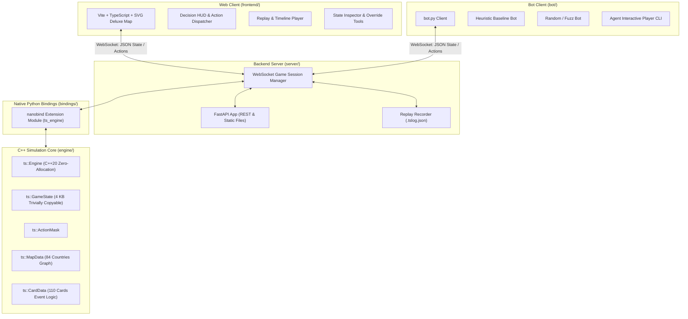

# Twilight Struggle AI: Project Guide & Agent Instructions

This repository contains the complete AI, simulation engine, web workbench, and training infrastructure for the Deluxe Edition of **Twilight Struggle** (110 Cards).

---

## 1. Project Architecture & Components



---

## 2. Directory Structure

```
.
├── AGENTS.md                   # Top-level instructions and architecture overview (this file)
├── CMakeLists.txt              # Root build configuration for C++ core and nanobind module
├── .gitignore                  # Git ignore rules for build, venv, node, logs, and rules/
├── .python-version             # Python runtime version pinned for environment
│
├── rules/                      # [GIT IGNORED] General game rules, PDF, map & card descriptions
│   ├── Rules_Final.pdf         # Official Twilight Struggle Deluxe Edition rulebook
│   ├── rules.md / rules.json   # Formal mathematical rules specification
│   ├── cards.json / primitives # 110 cards metadata and state machine primitives
│   ├── flags.json              # 43 persistent continuous effect bits
│   ├── map.json / map.md       # 84-country graph topology & coordinates
│   └── render_map.py           # Reference topology layout generator
│
├── engine/                     # Core C++20 simulation engine (see engine/AGENTS.md)
│   ├── CMakeLists.txt          # Engine library, unit tests, fuzzer, benchmark targets
│   ├── AGENTS.md               # Specific instructions for maintaining the C++ engine
│   ├── include/ts/             # Public C++ headers (GameState, MicroAction, ActionMask, etc.)
│   ├── src/                    # Implementation files (scoring, ops, cards, state machine)
│   └── tests/                  # C++ test suites (ts_tests, ts_fuzz, ts_benchmark)
│
├── bindings/                   # Native Python bridge via nanobind (see bindings/AGENTS.md)
│   ├── CMakeLists.txt          # Module build instructions
│   ├── AGENTS.md               # Specific instructions for maintaining the Python bindings
│   └── ts_bindings.cpp         # nanobind module exporting ts_engine
│
├── server/                     # FastAPI game server and replay manager (see server/AGENTS.md)
│   ├── AGENTS.md               # Specific instructions for server maintainers
│   ├── main.py                 # FastAPI app, REST routes, WebSocket endpoint /ws/game/{id}
│   ├── session.py              # GameSession class, micro-action router, state broadcasting
│   └── replay.py               # ReplayLogger and ReplayManager for .tslog.json files
│
├── bot/                        # Standalone bot clients (see bot/AGENTS.md)
│   ├── AGENTS.md               # Specific instructions for developing AI bots
│   ├── bot_client.py           # CLI bot runner (RandomBot, HeuristicBot, custom agents)
│   └── agent_player.py         # Rich CLI & interactive agent player interface
│
├── frontend/                   # Modern Web UI & Game Workbench (see frontend/AGENTS.md)
│   ├── AGENTS.md               # Specific instructions for frontend development
│   ├── package.json            # Node dependencies (Vite, TypeScript)
│   ├── vite.config.ts          # Vite build & WebSocket proxy configuration
│   ├── index.html              # Workbench layout
│   └── src/                    # TypeScript components (map_view, tracks, cards, action_hud, replay)
│
├── tests/                      # Python pytest integration test suite
│   ├── test_all_110_cards.py   # Comprehensive unit tests for all 110 cards
│   ├── test_bindings.py        # Validates Python nanobind module
│   ├── test_server_and_bot.py  # Validates REST APIs, bot-vs-bot WebSocket simulation, replays
│   └── test_web_workbench.py   # Validates map/card metadata endpoints and DOM structure
│
└── replays/                    # Recorded game logs in standardized .tslog.json format
```

---

## 3. Mandatory Documentation Maintenance Rule for Agents

> [!IMPORTANT]
> **Documentation Must Always Match Code Changes**:
> Whenever making any changes to the codebase (e.g. adding or updating card logic, engine features, build targets, sanitizer options, bot interfaces, API endpoints, or frontend views), you **MUST** update all corresponding documentation files:
> - Root [`AGENTS.md`](file:///home/mihaild/prog/ts_ai/AGENTS.md)
> - Subdirectory guides: [`engine/AGENTS.md`](file:///home/mihaild/prog/ts_ai/engine/AGENTS.md), [`frontend/AGENTS.md`](file:///home/mihaild/prog/ts_ai/frontend/AGENTS.md), [`server/AGENTS.md`](file:///home/mihaild/prog/ts_ai/server/AGENTS.md), [`bot/AGENTS.md`](file:///home/mihaild/prog/ts_ai/bot/AGENTS.md), and [`bindings/AGENTS.md`](file:///home/mihaild/prog/ts_ai/bindings/AGENTS.md).
> Ensure that all commands, directory listings, architecture diagrams, and testing instructions reflect the exact active state of the repository.

---

## 4. Developer & Agent Workflows

### 4.1 Initial Environment Setup
```bash
# 1. Python virtual environment
python3 -m venv .venv
source .venv/bin/activate
pip install nanobind fastapi "uvicorn[standard]" websockets pytest numpy pydantic httpx

# 2. Frontend dependencies & production build
cd frontend && npm install && npm run build && cd ..
```

### 4.2 Build C++ Engine & Nanobind Extension
```bash
# Standard Release Build
cmake -B build -S . -DPython_EXECUTABLE=$(pwd)/.venv/bin/python3
cmake --build build -j
```
*Output: Generates `./ts_engine.cpython-*.so` in the workspace root, as well as `./build/engine/ts_tests`, `ts_fuzz`, `ts_benchmark`.*

### 4.3 Build with Sanitizers (ASan + UBSan)
```bash
# AddressSanitizer & UndefinedBehaviorSanitizer Debug Build
cmake -B build_san -S . -DPython_EXECUTABLE=$(pwd)/.venv/bin/python3 \
  -DCMAKE_BUILD_TYPE=Debug \
  -DCMAKE_CXX_FLAGS="-fsanitize=address,undefined -fno-omit-frame-pointer -g" \
  -DCMAKE_EXE_LINKER_FLAGS="-fsanitize=address,undefined" \
  -DCMAKE_SHARED_LINKER_FLAGS="-fsanitize=address,undefined"
cmake --build build_san -j
```

### 4.4 Run Test Suites

#### Standard Tests & Fuzzing:
```bash
# C++ Unit Tests (276 tests) & Performance Benchmark
./build/engine/ts_tests
./build/engine/ts_benchmark

# Invariant Fuzzer (e.g. 10,000 games or 5,000,000 steps)
./build/engine/ts_fuzz --games 10000
./build/engine/ts_fuzz --steps 5000000

# Python Integration Tests (124 tests)
PYTHONPATH=. .venv/bin/pytest -v tests/
```

#### Sanitizers Run:
```bash
# C++ Unit Tests under ASan + UBSan
./build_san/engine/ts_tests

# Fuzzer under ASan + UBSan
./build_san/engine/ts_fuzz --games 10000
./build_san/engine/ts_fuzz --steps 5000000

# Python Integration Tests under ASan
LD_PRELOAD=/usr/lib/libasan.so ASAN_OPTIONS=detect_leaks=0:verify_asan_link_order=0 PYTHONPATH=. .venv/bin/pytest -v tests/
```

### 4.5 Launch Web Workbench & Play Against Bot
```bash
# 1. Start backend server (serves web UI on port 8000)
PYTHONPATH=. .venv/bin/python -m uvicorn server.main:app --host 0.0.0.0 --port 8000

# 2. In a separate terminal, launch a bot for the opponent (e.g. USSR)
PYTHONPATH=. .venv/bin/python -m bot.bot_client --game-id game-1 --role USSR --type heuristic

# 3. Open browser at:
# http://localhost:8000/?game_id=game-1&role=US
# Or view replays at:
# http://localhost:8000/?replay=llm_match_with_commentary.tslog.json
```

---

## 5. Key Maintenance Invariants for Agents

1. **Zero Heap Allocations in Engine Core**:
   `ts::GameState` must remain trivially copyable (`std::is_trivially_copyable_v<GameState>`) and within 4 KB. Never use heap structures (`std::vector`, `std::string`, `std::map`) within `GameState` or `DecisionContext`.
2. **Nanobind Enums with `nb::is_arithmetic()`**:
   When adding or updating enums in `bindings/ts_bindings.cpp`, always enable `nb::is_arithmetic()` so they can be cast to/from integers cleanly in Python.
3. **Deterministic PRNG**:
   All randomness in the engine uses `state.rng_state` with SplitMix64 (`ts::Prng`). Never use `rand()` or `std::mt19937` inside `ts::Engine::step()`.
4. **Replay Preservation**:
   All micro-actions must be fully recorded by `ReplayLogger` in `server/replay.py` to ensure exact replayability from the initial seed.
5. **Full State Visibility (No Secrecy Required)**:
   The UI and server explicitly support perfect information for debugging—both hands, hidden cards, and deck locations are transparently visible to players and observers.
6. **Rules Isolation**:
   Original game rules and descriptive documents live in `rules/` and remain git ignored.

---

## 6. Subdirectory Guides

For component-specific development, refer to:
- [`engine/AGENTS.md`](file:///home/mihaild/prog/ts_ai/engine/AGENTS.md) — C++ engine architecture, card handlers, action masking, micro-decisions, sanitizers, and fuzzing.
- [`bindings/AGENTS.md`](file:///home/mihaild/prog/ts_ai/bindings/AGENTS.md) — nanobind bridge, dictionary serialization, types export, ASan preload.
- [`server/AGENTS.md`](file:///home/mihaild/prog/ts_ai/server/AGENTS.md) — FastAPI server, session management, WebSocket protocol, replay logging.
- [`bot/AGENTS.md`](file:///home/mihaild/prog/ts_ai/bot/AGENTS.md) — Bot interface, heuristic and random strategies, interactive agent player CLI.
- [`frontend/AGENTS.md`](file:///home/mihaild/prog/ts_ai/frontend/AGENTS.md) — Vite + TypeScript web client, SVG map, decision HUD, active continuous effects panel, branch catalog, replay player.
