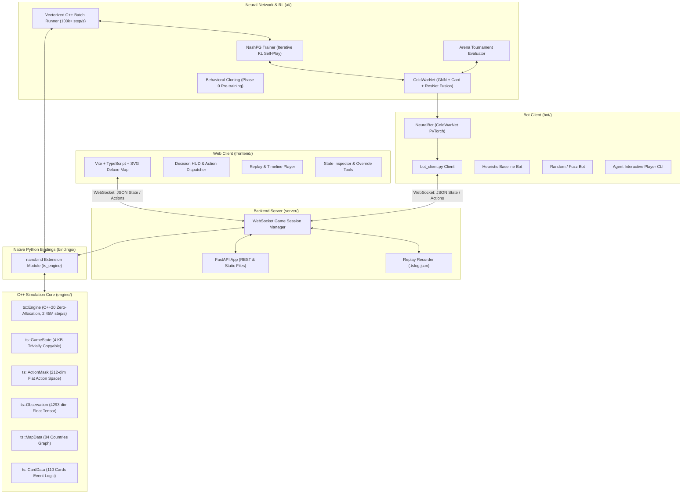

# Twilight Struggle AI: Project Guide & Agent Instructions

This repository contains the complete AI, simulation engine, web workbench, and training infrastructure for the Deluxe Edition of **Twilight Struggle** (110 Cards).

---

## 1. Project Architecture & Components



---

## 2. Directory Structure

```
.
├── AGENTS.md                   # Top-level instructions and architecture overview (this file)
├── CMakeLists.txt              # Root build configuration for C++ core and nanobind module
├── .gitignore                  # Git ignore rules for build, venv, node, logs, and rules/
├── .python-version             # Python runtime version pinned for environment
│
├── ai/                         # Neural Network & Reinforcement Learning (NashPG / ColdWarNet)
│   ├── env/                    # Environment wrappers & flat action codecs
│   │   ├── action_encoder.py   # 212-dim Flat Action <-> MicroAction bidirectional codec
│   │   └── ts_env.py           # Single & Vectorized batched C++ simulation wrapper
│   ├── models/                 # Neural network architectures
│   │   └── coldwar_net.py      # ColdWarNet (GNN GraphConv + Card + Global ResNet + Masked Heads)
│   ├── training/               # Training pipelines & algorithms
│   │   ├── rollout_buffer.py   # Trajectory storage & GAE advantage calculator
│   │   ├── behavioral_cloning.py # Phase 0 supervised pre-training
│   │   ├── nash_pg.py          # NashPG (Nash Policy Gradient with iterative KL regularization)
│   │   └── train.py            # Unified CLI training & evaluation runner
│   └── eval/                   # Tournament evaluation & arena metrics
│       └── arena.py            # Automated tournament evaluator vs HeuristicBot / RandomBot
│
├── rules/                      # [GIT IGNORED] General game rules, PDF, map & card descriptions
│   ├── Rules_Final.pdf         # Official Twilight Struggle Deluxe Edition rulebook
│   ├── rules.md / rules.json   # Formal mathematical rules specification
│   ├── cards.json / primitives # 110 cards metadata and state machine primitives
│   ├── flags.json              # 47 persistent continuous effect & state bits
│   ├── map.json / map.md       # 84-country graph topology & coordinates
│   └── render_map.py           # Reference topology layout generator
│
├── engine/                     # Core C++20 simulation engine (see engine/AGENTS.md)
│   ├── CMakeLists.txt          # Engine library, unit tests, fuzzer, benchmark targets
│   ├── AGENTS.md               # Specific instructions for maintaining the C++ engine
│   ├── include/ts/             # Public C++ headers (GameState, MicroAction, ActionMask, etc.)
│   ├── src/                    # Implementation files (scoring, ops, cards, state machine)
│   └── tests/                  # C++ test suites (ts_tests, ts_fuzz, ts_benchmark)
│
├── bindings/                   # Native Python bridge via nanobind (see bindings/AGENTS.md)
│   ├── CMakeLists.txt          # Module build instructions
│   ├── AGENTS.md               # Specific instructions for maintaining the Python bindings
│   └── ts_bindings.cpp         # nanobind module exporting ts_engine & VectorizedBatchRunner
│
├── server/                     # FastAPI game server and replay manager (see server/AGENTS.md)
│   ├── AGENTS.md               # Specific instructions for server maintainers
│   ├── main.py                 # FastAPI app, REST routes, WebSocket endpoint /ws/game/{id}
│   └── session.py              # GameSession class, micro-action router, state broadcasting
│
├── bot/                        # Bot clients & interactive players (see bot/AGENTS.md)
│   ├── AGENTS.md               # Specific instructions for developing AI bots
│   ├── neural_bot.py           # NeuralBot client using ColdWarNet checkpoints
│   ├── bot_client.py           # CLI bot runner (RandomBot, HeuristicBot, NeuralBot)
│   └── agent_player.py         # Rich CLI & interactive agent player interface
│
├── tests/                      # Python pytest integration test suite (343 tests)
│   ├── test_neural_and_nashpg.py # Unit & integration tests for ColdWarNet, ActionMask, NashPG
│   ├── test_all_110_cards.py   # Comprehensive unit tests for all 110 cards
│   ├── test_all_110_cards_differential.py # Exhaustive 110-card cross-engine validation (131 tests)
│   ├── test_struggler_differential.py # Cross-engine differential test suite
│   ├── test_card_fixes.py      # Dedicated verification suite for card rules fixes
│   ├── test_bindings.py        # Validates Python nanobind module
│   ├── test_server_and_bot.py  # Validates REST APIs, bot-vs-bot WebSocket simulation
│   └── test_e2e_space_race.py  # Playwright E2E browser tests
│
└── replays/                    # Recorded game logs in standardized .tslog.json format
```

---

## 3. Developer & Agent Workflows

### 3.1 Initial Environment Setup
```bash
# 1. Python virtual environment
python3 -m venv .venv
source .venv/bin/activate
pip install nanobind fastapi "uvicorn[standard]" websockets pytest numpy pydantic httpx torch torchvision

# 2. Frontend dependencies & production build
cd frontend && npm install && npm run build && cd ..
```

### 3.2 Build C++ Engine & Nanobind Extension
```bash
# Standard Release Build
cmake -B build -S . -DPython_EXECUTABLE=$(pwd)/.venv/bin/python3
cmake --build build -j
```

### 3.3 Training & Evaluating Neural Networks (ColdWarNet / NashPG)

```bash
# Phase 0: Supervised Behavioral Cloning Pre-Training
PYTHONPATH=. .venv/bin/python -m ai.training.train --mode bc --bc-games 1000 --bc-epochs 10 --save-path checkpoints/coldwar_net_bc.pt

# Phase 1: NashPG (Nash Policy Gradient) Self-Play Reinforcement Learning
PYTHONPATH=. .venv/bin/python -m ai.training.train --mode nashpg --load-path checkpoints/coldwar_net_bc.pt --num-envs 64 --buffer-size 128 --iterations 100 --eta 0.1 --save-path checkpoints/coldwar_net.pt

# Phase 2: Tournament Evaluation
PYTHONPATH=. .venv/bin/python -m ai.training.train --mode eval --load-path checkpoints/coldwar_net.pt --eval-games 100 --eval-opponent heuristic
```

### 3.4 Launch Web Workbench & Play Against NeuralBot
```bash
# 1. Start backend server (serves web UI on port 8000)
PYTHONPATH=. .venv/bin/python -m uvicorn server.main:app --host 0.0.0.0 --port 8000

# 2. In a separate terminal, launch NeuralBot for the opponent (e.g. USSR)
PYTHONPATH=. .venv/bin/python -m bot.bot_client --game-id game-1 --role USSR --type neural --model-path checkpoints/coldwar_net.pt

# 3. Open browser at:
# http://localhost:8000/?game_id=game-1&role=US
```

### 3.5 Run Test Suites
```bash
# C++ Unit Tests (299 tests) & Performance Benchmark
./build/engine/ts_tests
./build/engine/ts_benchmark

# Python Integration Tests (343 tests including Neural & NashPG suite)
PYTHONPATH=.:external/struggler/src .venv/bin/pytest -v tests/
```

---

## 4. Key Maintenance Invariants for Agents

1. **Zero Heap Allocations in Engine Core**:
   `ts::GameState` must remain trivially copyable (`std::is_trivially_copyable_v<GameState>`) and within 4 KB.
2. **212-Dimensional Flat Action Space**:
   All neural network policy heads and action masks operate over the exact 212 flat action space mapped by `ActionEncoder` and `ActionMask::generate_flat_mask_212`.
3. **NashPG Reference Regularization**:
   The active policy $\pi_\theta$ is regularized against the frozen outer-loop snapshot $\pi_{\text{ref}}^{(k)}$ with fixed $\eta$, ensuring monotonic convergence to Nash equilibrium without strategy cycling.
4. **Deterministic PRNG**:
   All simulation randomness uses `state.rng_state` with SplitMix64 (`ts::Prng`).
