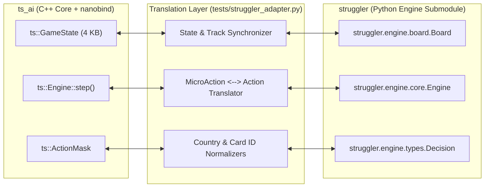

# Twilight Struggle Engine Architecture & Structural Comparison: `ts_ai` vs `struggler`

This document provides a comprehensive comparative investigation between **`ts_ai`** (this project) and **[`struggler`](https://github.com/alekpinel/struggler)** (an external Python-based Twilight Struggle engine).

---

## 1. Executive Summary & Design Philosophies

Both projects implement the complete rules and all 110 cards of the **Twilight Struggle Deluxe Edition** with fine-grained atomic decision mechanics (e.g. 1 Ops point placement per step). However, their target domains and architectural foundations reflect distinct design objectives:

| Feature / Dimension | `ts_ai` (This Repository) | `struggler` (Submodule) |
| :--- | :--- | :--- |
| **Primary Domain** | High-throughput RL / MCTS simulation, zero-overhead execution, low-latency multi-agent workbench | LLM prompt engineering, turn-planning AI evaluation, and human/physical referee mode |
| **Core Language** | **C++20** with zero heap allocations in engine core | **Python 3.12+** object-oriented dataclasses |
| **State Representation** | Fixed 4 KB trivially copyable struct (`ts::GameState`) | Composable Python dictionary / dataclass hierarchy (`Board`, `Engine`) |
| **Decision Model** | Compact 4-byte `MicroAction` & dense 128-bit `ActionMask` | Typed `Decision` and `Action(kind, payload)` objects |
| **Decision Stack** | Fixed 3-deep statically allocated array (`ctx_stack`) | Unbounded dynamic Python `list[Decision]` |
| **PRNG / Stochasticity** | Embedded SplitMix64 determinism inside `state.rng_state` | Injected Python `random.Random` with explicit `Side.CHANCE` decisions |
| **Client / Workbench** | FastAPI WebSocket server + Vite/TypeScript interactive SVG map UI | CLI runner, JSON replay logs, and LLM prompt serialization |
| **Performance Target** | Millions of steps / second for tree search & reinforcement learning | Ergonomic, inspectable JSON AST for LLM agent integration |

---

## 2. Architectural Comparison

### 2.1 State Representation & Memory Invariants

#### `ts_ai` (`engine/include/ts/game_state.hpp`):
- `ts::GameState` is strictly trivially copyable (`std::is_trivially_copyable_v<GameState>`), fitting entirely inside 4 KB with zero heap allocations (`std::vector`, `std::string`, or `std::map` are forbidden).
- Board influence across 84 countries is stored in `std::array<CountryState, 84>`, where each country holds `uint8_t us_influence` and `uint8_t ussr_influence`.
- Continuous persistent effects (e.g., NATO, Containment, Brezhnev Doctrine, Space attempt markers) are encoded as discrete bits inside a single 64-bit bitmask (`uint64_t persistent_effects`).

#### `struggler` (`src/struggler/engine/board.py`, `core.py`):
- Uses standard Python object models: `Board` holds `influence: dict[str, dict[str, int]]` keyed by country name strings (`"East_Germany"`, `"Poland"`).
- Persistent modifiers are stored in standard Python dictionaries: `turn_effects: dict[str, object]` (cleared at turn end) and `game_effects: dict[str, object]` (persistent across turns).

### 2.2 Decision Mechanics & Action Space

#### `ts_ai` Micro-Action Model:
- Decisions are decomposed into primitive types (`DecisionType`):
  1. `POINT_NODE` (0..83 country index or 0x80 early stop)
  2. `SELECT_CARD` (1..110 card ID)
  3. `SELECT_PLAY_MODE` (EVENT=0, OPS=1, SPACE=2)
  4. `CHOOSE_TIMING_BRANCH` (OPS_FIRST=0, EVENT_FIRST=1)
  5. `SELECT_OP_MODE` (INFLUENCE=0, COUP=1, REALIGN=2)
  6. `CHOOSE_BRANCH` (0..7 sub-options or 0x80 early stop)
- Action masks are represented as a dense byte array `uint8_t mask[128]`, enabling zero-cost bitwise validation and fast neural network head masking.

#### `struggler` Typed Action Model:
- Employs typed enum `DecisionKind` with payload dictionaries:
  - `DecisionKind.PLACE_INFLUENCE` with `payload={"country": "Poland"}`
  - `DecisionKind.COUP_TARGET` with `payload={"country": "Cuba"}`
  - `DecisionKind.PLAY_MODE` with `payload={"mode": "ops"}`
  - `DecisionKind.EVENT_OPS_ORDER` with `payload={"order": "event_first"}`
- Offers ergonomic pattern-matching and JSON-serializable payloads for LLM interaction.

### 2.3 Handling Chance & Stochastic Outcomes

#### `ts_ai`:
- Dice rolls (Coups, Realignments, Space Race, War cards) are resolved **internally** within `Engine::step()` using the deterministic SplitMix64 PRNG in `state.rng_state`.
- Outcomes are structured and recorded in `state.last_roll` (`DieRollRecord`) and `state.action_history` for replay fidelity.

#### `struggler`:
- Chance rolls are pushed onto the decision stack with `actor=Side.CHANCE` (e.g. `DecisionKind.COUP_ROLL`, `DecisionKind.REALIGNMENT_ACTOR_ROLL`, `DecisionKind.WAR_ROLL`).
- The engine consumes its internal RNG by submitting an explicit `Action(kind=COUP_ROLL, payload={"roll": ...})`, allowing deterministic replay logging in JSON format.

---

## 3. Data Model & Topological Equivalences

### 3.1 Country Topology & Graph Parity
Both implementations model the official 84-country graph with exact parity in stability, battleground flags, and region assignments:
- **84 Standard Nodes**: Identical stability ratings (e.g., Israel=4, Cuba=2, Italy=2, West Germany=4, Poland=3).
- **Battleground Nodes**: Identical assignment across all regions.
- **Naming Normalization**:
  - `ts_ai` uses spaced country names (`"East Germany"`, `"West Germany"`, `"Dominican Rep"`, `"United Kingdom"`, `"Spain/Portugal"`).
  - `struggler` uses underscored tokens (`"East_Germany"`, `"West_Germany"`, `"Dominican_Republic"`, `"UK"`, `"Spain_Portugal"`).
- **Topology Parity**:
  - Both engines model the exact same 84-country graph with 100% identical adjacency edges across all countries, with Syria and Iraq not being adjacent.

### 3.2 Card Database (All 110 Cards)
All 110 cards (Early War 1..35, Mid War 36..81, Late War 82..110) match 100% in:
- Card number (1 to 110).
- Operations value (0 for scoring cards, 1 to 4 for operational cards).
- Allegiance (`US`, `USSR`, `NEUTRAL` / `NONE`).
- Era (`EARLY_WAR`, `MID_WAR`, `LATE_WAR`).
- Scoring and War card classifications.

---

## 4. Game Rules & Mechanics Validation

The cross-engine differential validation suite ([`tests/test_struggler_differential.py`](file:///home/mihaild/prog/ts_ai/tests/test_struggler_differential.py)) proves mechanical parity across the following systems:

1. **Opening Setup Phase**:
   - USSR 6 influence placement across Eastern Europe (identical legal candidates at each step).
   - US 7 influence placement across Western Europe (identical legal candidates at each step).
   - Resulting board influence matches 100%.

2. **Operations & Reachability (Rule 6.1.1)**:
   - Influence placement is restricted to countries with or adjacent to friendly influence at the start of the action round snapshot.
   - Placing influence in opponent-controlled countries costs 2 Ops in both engines.

3. **Coups & DEFCON Restrictions**:
   - DEFCON 5: All regions permitted.
   - DEFCON 4: Europe prohibited.
   - DEFCON 3: Europe & Asia prohibited.
   - DEFCON 2: Europe, Asia & Middle East prohibited.
   - Coup resolution formula: `Net = Roll + Card_Ops - (2 * Stability)`.

4. **Realignments**:
   - Realignment roll modifiers: +1 if adjacent to friendly controlled country, +1 if more influence than opponent, +1 if adjacent to superpower.

5. **Space Race Track**:
   - Exact threshold ops requirements for Boxes 1..8 (2, 2, 2, 2, 3, 3, 3, 4).
   - Victory points milestones (First vs Second player awards).

6. **Regional & Final Scoring**:
   - Exact arithmetic for Presence, Domination, and Control.
   - Bonus points for controlled battlegrounds and countries adjacent to the opponent superpower.

7. **Card Events Mechanics**:
   - War cards (Korean War, Arab-Israeli War, Indo-Pakistani War, Brush War).
   - Complex influence manipulation (Duck and Cover, Socialist Governments, Fidel, Truman Doctrine, Decolonization, Marshall Plan).
   - Persistent modifiers (Vietnam Revolts, US/Japan Mutual Security Treaty).

---

## 5. Integration Architecture

To facilitate cross-validation and differential analysis, the following bridge components are established:



---

## 6. Running the Differential Test Suite

To run the differential cross-engine validation suite:

```bash
# Run all 36 differential validation tests
PYTHONPATH=.:external/struggler/src .venv/bin/pytest -v tests/test_struggler_differential.py

# Run all test suites in the repository
PYTHONPATH=. .venv/bin/pytest -v tests/
```
