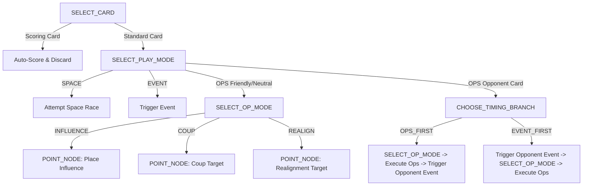

# Twilight Struggle Engine Developer & Agent Guide (`engine/AGENTS.md`)

Welcome to the **Twilight Struggle Engine (`engine/`)** codebase. This guide provides AI agents and human developers with an architectural overview, directory conventions, key invariants, and instructions for extending or maintaining the simulation engine.

---

## 1. Engine Mission & Performance Mandate

The simulation engine is designed for high-performance reinforcement learning (AlphaZero / MuZero / MCTS / PPO) training for Twilight Struggle (Deluxe Edition, 110 Cards).

### Core Architectural Invariants:
1. **ISO C++20 Compliance**: Written in modern C++20.
2. **Zero-Allocation Execution**:
   - `sizeof(GameState) \approx 1.1\text{ KB} \le 4\text{ KB}`, `alignas(64)`.
   - `std::is_trivially_copyable_v<GameState>` MUST remain `true`.
   - Never use pointers, virtual tables, heap allocations (`malloc`, `new`, `std::vector`, `std::string`, `std::unique_ptr`) inside `GameState`, `DecisionContext`, `CountryState`, or the active step loop.
   - Fast state copying is done via bitwise memory copy (`std::memcpy`).
3. **Simulation Throughput**: Target was $\ge 100\text{k}$ steps/sec/core. The engine achieves **$\ge 2,000,000$ steps/sec/core** in single-threaded release mode.
4. **Deterministic Bit-for-Bit State**: Built-in 64-bit SplitMix64 PRNG (`Prng`) ensures perfect replayability from integer seeds.

---

## 2. Directory Structure

```
engine/
├── CMakeLists.txt              // Build target for ts_engine library, ts_tests, ts_fuzz, ts_benchmark
├── AGENTS.md                   // Developer and agent documentation (this file)
├── progress.md                 // Progress report and future work items
├── include/ts/                 // Public and internal engine headers
│   ├── types.hpp               // Enums: Player, Phase, WarEra, CardLocation, DecisionType, ActionType, Region, SubRegion, PlayMode, TimingBranch, OpMode
│   ├── constants.hpp           // Country IDs, Card IDs (1..110), 64-bit Effect Flags, Bit Masks
│   ├── micro_action.hpp        // 4-byte packed MicroAction struct (alignas(4))
│   ├── game_state.hpp          // Contiguous trivially copyable GameState struct
│   ├── prng.hpp                // Deterministic SplitMix64 PRNG
│   ├── map_data.hpp            // 84 countries static metadata, graph adjacency 128-bit bitmasks
│   ├── card_data.hpp           // 110 cards static metadata (Ops, side, era, asterisk, scoring)
│   ├── scoring.hpp             // Region scoring formulas (Presence/Domination/Control), victory evaluation
│   ├── ops.hpp                 // Influence placement, Coup mechanics, Realignment rolls, dynamic costs
│   ├── space_race.hpp          // Space race tracks, milestone rewards, and special abilities
│   ├── card_handlers.hpp       // Card event handlers and sub-decision dispatch declarations
│   ├── action_mask.hpp         // Legal action mask generator per DecisionType
│   ├── state_machine.hpp       // Turn and Action Round lifecycle, Headline resolution
│   ├── observation.hpp         // Neural observation feature extractor (ObservationBuffer)
│   ├── serialization.hpp       // Binary snapshot and JSON serialization
│   └── engine.hpp              // Top-level ts::Engine public interface
├── src/                        // Engine implementations
│   ├── map_data.cpp            // Static country array and adjacency lookup tables
│   ├── card_data.cpp           // Static card metadata array
│   ├── scoring.cpp             // Regional scoring and final scoring math
│   ├── ops.cpp                 // Ops execution and target validation
│   ├── space_race.cpp          // Space race advancement
│   ├── events/
│   │   ├── early_war.cpp       // Cards 1-35, 103-106 event handlers
│   │   ├── mid_war.cpp         // Cards 36-81, 107-108 event handlers
│   │   └── late_war.cpp        // Cards 82-102, 109-110 event handlers
│   ├── card_dispatcher.cpp     // Event trigger dispatch, sub-decision step router, action mask filters
│   ├── action_mask.cpp         // ActionMask::generate_mask implementation
│   ├── state_machine.cpp       // State machine turn loop, setup, headline, and AR transitions
│   ├── observation.cpp         // Feature extractor implementation
│   ├── serialization.cpp       // Serializer binary & JSON implementations
│   └── engine.cpp              // ts::Engine API implementation
└── tests/                      // Engine test suites
    ├── test_framework.hpp      // Lightweight assertion & test registry framework
    ├── test_main.cpp           // Test runner
    ├── test_map.cpp            // Topology, battlegrounds count, adjacency symmetry tests
    ├── test_scoring.cpp        // Regional formulas, Europe control instant win tests
    ├── test_ops.cpp            // Dynamic cost drop, Coup DEFCON degradation, NATO tests
    ├── test_cards_early.cpp    // Early war card unit tests
    ├── test_cards_mid.cpp      // Mid war card unit tests
    ├── test_cards_late.cpp     // Late war card unit tests
    ├── test_defcon_suicide.cpp // DEFCON suicide priority in OPS_FIRST vs EVENT_FIRST
    ├── test_reentrancy.cpp     // Re-entrant DecisionContext stack tests
    ├── test_fuzz.cpp           // 100k - 1M step invariant fuzzer
    └── test_benchmark.cpp      // 500k-step throughput benchmark
```

---

## 3. Micro-Decision Pipeline & Action Representation

The engine splits complex turns into a sequential stream of atomic 4-byte `MicroAction` structures:

```cpp
struct alignas(4) MicroAction {
    DecisionType decision_type; // 1 byte: SELECT_CARD, SELECT_PLAY_MODE, CHOOSE_TIMING_BRANCH, SELECT_OP_MODE, POINT_NODE, CHOOSE_BRANCH
    uint8_t      primary_id;    // 1 byte: Card ID (1..110), Country ID (0..83), Branch ID (0..7), PlayMode, OpMode, TimingBranch, or CONFIRM_DONE (0x80)
    uint8_t      secondary_id;  // 1 byte: Sub-choice / quantity
    uint8_t      padding;       // 1 byte alignment padding
};
```

### Standard Action Round Decision Flow:


### Re-Entrant Card Contexts:
Cards like *Star Wars (#85)*, *Five Year Plan (#5)*, and *Grain Sales (#67)* push a new `DecisionContext` onto `state.ctx_stack` (max depth 3). Sub-decisions resolve until the child event finishes, at which point `state.pop_context()` resumes the parent decision.

---

## 4. Key Rules Handled by the Engine

- **Strict DEFCON Suicide**: If DEFCON drops to 1, the **phasing player** loses immediately, regardless of whose card caused the drop.
- **Dynamic Influence Cost Transition**: Cost is 2 Ops when placing influence into an enemy-controlled country; as soon as enemy control is broken by a placement, subsequent placements in the same AR immediately cost only 1 Op.
- **Persistent Flags & Turn Cleanup**: All 43 continuous effects are tracked in `state.persistent_effects` (64-bit bitfield). Turn-cleanup effects are cleared at Phase H via `TURN_CLEANUP_MASK` (`0x00000780A3CBE3C0ULL`).
- **Headline Priority**: Highest Headline Value (Ops) resolves first; ties are broken in favor of the US player. Space Box 4 (Man in Space) forces the opponent to select and reveal their headline first.
- **Space Race Safe Discard**: Discarding an opponent card for the Space Race cancels the opponent's event completely.

---

## 5. How to Build, Test, and Benchmark

### Build from Project Root:
```bash
cmake -B build -DCMAKE_BUILD_TYPE=Release
cmake --build build -j
```

### Run Unit Tests:
```bash
./build/engine/ts_tests
```

### Run Invariant Fuzzer (e.g. 100k or 1M steps):
```bash
./build/engine/ts_fuzz --steps 1000000 --seed 42
```

### Run Performance Benchmark:
```bash
./build/engine/ts_benchmark
```

---

## 6. Guidelines for Extending the Engine

1. **Never Allocate Heap Memory in State Types**: Always ensure `static_assert(std::is_trivially_copyable_v<GameState>);` passes.
2. **Deterministic PRNG**: Use `Prng::roll_d6(state.rng_state)` or `Prng::random_index(state.rng_state, n)` whenever game state dice or shuffles are executed.
3. **Always Update Tests When Changing Card Logic**: Add test cases in `engine/tests/test_cards_*.cpp` for any new card behaviors or edge cases.
