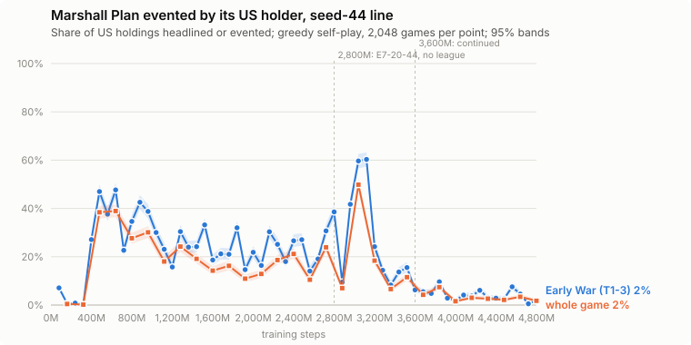

# When the US stopped playing Marshall Plan for its event, seed-44 line (2026-10-05)

Owner: find at which point during training the model stopped playing Marshall Plan as the US.

Marshall Plan (US, 4 Ops, Early War): 1 US Influence in each of 7 non-USSR-controlled countries of
Western Europe; it also unlocks NATO.

**Method.** `tools/scripts/card_event_trajectory.py` (new): greedy self-play of each snapshot,
every US holding of Marshall Plan in which the event could trigger at one of the US's card
choices, counted by how it ended -- evented (headlined, or the event in a round), played for Ops or
the space race, or not played by the US (the census's definition, `OwnCardChoices` of
`checkpoint_report`). The line is seed 44 without the league: E7-01-44 (0-560M), E7-02-44 (to
1,200M), E7-17-44 (2,000M), E7-19-44 (2,400M), E7-20-44 (2,800M), then E7-20-44's control leg
(2,800-3,600M, `E7-20-44_20261005_085738`) and its continuation (3,600-4,800M,
`E7-20-44_20261005_174535`); the snapshot nearest each mark. Two sweeps, 2,048 games each, seed
55,000: **Early War only** (games stopped after turn 3; a holding still in hand then counts as not
played) at every 80M, and **whole games** at every 160M.

## Result

**The US stopped between 3,200M and 3,360M**, on the no-league control leg. Before that it
headlined Marshall Plan in roughly 15-60% of holdings at every snapshot from 400M; from 3,280M the
Early War rate is 14%, 8%, 14%, 16%, 6% (3,600M), and from 3,680M on 0.5-9.6% (4,720M: 0.5%,
4,800M: 1.8%). The whole-game rate falls the same way: 18% at 3,200M, 7% at 3,360M, 1.6-3.4% from
4,000M. The last high point is 3,120M (60% Early War).

* **It was never an action-round event.** Every evented holding is a headline; in a round the US
  played it for Ops (0.0-0.2% event in a round at every snapshot after 80M; 1.2% at 80M).
* **It also started late.** Up to 320M the US almost never evented it (7% at 80M, under 1% at
  160-320M); the headline appears at 400M (27%) and peaks at 480-640M (38-48%).
* **Snapshot to snapshot it swings widely** (e.g. 2,880M 9.5%, 2,960M 42%, 3,040M 60%), so the stop
  is read from the sustained run below 16% from 3,280M, not from any one point. The whole-game
  rate tracks the Early War one, a little lower (Marshall Plan held later in the game after a
  reshuffle is played for Ops).
* The five self-plays of the latest SWA (4,720-4,800M) agree: every US Marshall Plan in them is
  played for Ops (influence): 4 US plays, in seeds 1001 and 1003, at p 0.61-1.00 (the other three
  games had the USSR holding it).

Not measured here: the league branch (E7-21-44, from 2,800M), where the event census put Marshall
Plan at 34% evented at 3,200M; and why the play disappears (its value, or the Europe opening
changing around it).

## Early War (turns 1-3), every 80M

| checkpoint | holdings | evented | headline | event in a round | Ops / space race | not played |
|:---|---:|---:|---:|---:|---:|---:|
| 80M | 1,140 | **7.1%** | 5.9% | 1.2% | 91.4% | 1.5% |
| 160M | 1,110 | **0.6%** | 0.6% | 0.0% | 98.9% | 0.5% |
| 240M | 1,108 | **0.8%** | 0.8% | 0.0% | 98.9% | 0.3% |
| 320M | 1,169 | **0.3%** | 0.2% | 0.1% | 99.6% | 0.2% |
| 400M | 1,044 | **27.1%** | 27.1% | 0.0% | 72.6% | 0.3% |
| 480M | 1,075 | **47.0%** | 47.0% | 0.0% | 52.7% | 0.3% |
| 560M | 1,092 | **37.6%** | 37.6% | 0.0% | 61.9% | 0.5% |
| 640M | 1,049 | **47.7%** | 47.7% | 0.0% | 52.0% | 0.3% |
| 720M | 1,155 | **22.7%** | 22.6% | 0.1% | 76.9% | 0.4% |
| 800M | 1,095 | **34.6%** | 34.6% | 0.0% | 64.7% | 0.6% |
| 880M | 1,095 | **42.6%** | 42.6% | 0.0% | 56.6% | 0.8% |
| 960M | 1,068 | **38.8%** | 38.8% | 0.0% | 60.7% | 0.6% |
| 1040M | 1,088 | **30.1%** | 30.1% | 0.0% | 68.8% | 1.1% |
| 1120M | 1,061 | **23.1%** | 23.0% | 0.1% | 76.6% | 0.3% |
| 1200M | 1,093 | **15.7%** | 15.6% | 0.1% | 84.0% | 0.3% |
| 1280M | 1,059 | **30.4%** | 30.3% | 0.1% | 69.1% | 0.5% |
| 1360M | 1,126 | **24.0%** | 24.0% | 0.0% | 75.1% | 0.9% |
| 1440M | 1,141 | **24.2%** | 24.2% | 0.0% | 75.5% | 0.3% |
| 1520M | 1,130 | **33.2%** | 33.2% | 0.0% | 66.3% | 0.5% |
| 1600M | 1,132 | **18.6%** | 18.6% | 0.0% | 80.6% | 0.8% |
| 1680M | 1,098 | **21.2%** | 21.2% | 0.0% | 78.5% | 0.3% |
| 1760M | 1,081 | **21.0%** | 21.0% | 0.0% | 78.1% | 0.9% |
| 1840M | 1,091 | **32.0%** | 32.0% | 0.0% | 67.1% | 0.9% |
| 1920M | 1,131 | **14.7%** | 14.7% | 0.0% | 84.4% | 1.0% |
| 2000M | 1,103 | **21.8%** | 21.8% | 0.0% | 77.3% | 0.8% |
| 2080M | 1,091 | **16.4%** | 16.4% | 0.0% | 82.3% | 1.3% |
| 2160M | 1,127 | **30.3%** | 30.3% | 0.0% | 69.1% | 0.5% |
| 2240M | 1,086 | **25.1%** | 25.1% | 0.0% | 73.7% | 1.2% |
| 2320M | 1,100 | **18.0%** | 18.0% | 0.0% | 80.5% | 1.5% |
| 2400M | 1,086 | **26.6%** | 26.6% | 0.0% | 71.4% | 2.0% |
| 2480M | 1,138 | **27.1%** | 27.1% | 0.0% | 71.8% | 1.1% |
| 2560M | 1,153 | **14.1%** | 14.1% | 0.0% | 85.3% | 0.7% |
| 2640M | 1,116 | **19.1%** | 19.1% | 0.0% | 79.7% | 1.3% |
| 2720M | 1,110 | **30.7%** | 30.7% | 0.0% | 68.7% | 0.5% |
| 2800M | 1,063 | **38.6%** | 38.6% | 0.0% | 60.4% | 1.0% |
| 2880M | 1,137 | **9.5%** | 9.5% | 0.0% | 88.7% | 1.8% |
| 2960M | 1,054 | **41.7%** | 41.7% | 0.0% | 57.2% | 1.0% |
| 3040M | 1,021 | **59.6%** | 59.6% | 0.0% | 40.1% | 0.3% |
| 3120M | 1,048 | **60.3%** | 60.3% | 0.0% | 39.1% | 0.6% |
| 3200M | 1,112 | **24.2%** | 24.2% | 0.0% | 75.8% | 0.0% |
| 3280M | 1,139 | **14.4%** | 14.3% | 0.1% | 85.5% | 0.1% |
| 3360M | 1,165 | **8.3%** | 8.3% | 0.0% | 91.2% | 0.4% |
| 3440M | 1,155 | **13.7%** | 13.5% | 0.2% | 86.1% | 0.3% |
| 3520M | 1,114 | **15.5%** | 15.5% | 0.0% | 84.4% | 0.1% |
| 3600M | 1,195 | **6.3%** | 6.3% | 0.0% | 93.3% | 0.4% |
| 3680M | 1,198 | **5.5%** | 5.5% | 0.0% | 94.1% | 0.4% |
| 3760M | 1,167 | **4.8%** | 4.8% | 0.0% | 94.6% | 0.6% |
| 3840M | 1,175 | **9.6%** | 9.6% | 0.0% | 90.2% | 0.2% |
| 3920M | 1,118 | **2.9%** | 2.9% | 0.0% | 96.8% | 0.4% |
| 4000M | 1,137 | **1.9%** | 1.9% | 0.0% | 97.7% | 0.4% |
| 4080M | 1,186 | **4.1%** | 4.0% | 0.1% | 95.9% | 0.0% |
| 4160M | 1,124 | **3.7%** | 3.7% | 0.0% | 96.0% | 0.3% |
| 4240M | 1,152 | **6.1%** | 6.1% | 0.0% | 93.8% | 0.1% |
| 4320M | 1,137 | **3.2%** | 3.2% | 0.0% | 96.6% | 0.3% |
| 4400M | 1,126 | **2.8%** | 2.8% | 0.0% | 97.0% | 0.2% |
| 4480M | 1,123 | **2.6%** | 2.6% | 0.0% | 97.1% | 0.4% |
| 4560M | 1,139 | **7.6%** | 7.6% | 0.0% | 92.3% | 0.2% |
| 4640M | 1,147 | **4.5%** | 4.5% | 0.0% | 95.1% | 0.3% |
| 4720M | 1,129 | **0.5%** | 0.5% | 0.0% | 99.4% | 0.1% |
| 4800M | 1,197 | **1.8%** | 1.8% | 0.0% | 97.7% | 0.4% |

## Whole games, every 160M

| checkpoint | holdings | evented | headline | event in a round | Ops / space race | not played |
|:---|---:|---:|---:|---:|---:|---:|
| 160M | 1,527 | **0.5%** | 0.5% | 0.0% | 96.0% | 3.5% |
| 320M | 1,559 | **0.2%** | 0.1% | 0.1% | 97.3% | 2.5% |
| 480M | 1,356 | **38.4%** | 38.4% | 0.0% | 59.6% | 2.0% |
| 640M | 1,348 | **38.9%** | 38.9% | 0.0% | 59.0% | 2.1% |
| 800M | 1,443 | **27.7%** | 27.7% | 0.0% | 69.4% | 3.0% |
| 960M | 1,391 | **30.1%** | 30.1% | 0.1% | 67.9% | 2.0% |
| 1120M | 1,363 | **18.0%** | 18.0% | 0.1% | 80.3% | 1.6% |
| 1280M | 1,368 | **24.2%** | 24.1% | 0.1% | 73.8% | 2.0% |
| 1440M | 1,515 | **19.1%** | 19.1% | 0.1% | 79.1% | 1.7% |
| 1600M | 1,509 | **14.2%** | 14.2% | 0.0% | 83.5% | 2.3% |
| 1760M | 1,397 | **16.2%** | 16.2% | 0.0% | 81.1% | 2.6% |
| 1920M | 1,525 | **11.0%** | 11.0% | 0.0% | 86.4% | 2.6% |
| 2080M | 1,472 | **12.9%** | 12.9% | 0.0% | 84.3% | 2.8% |
| 2240M | 1,474 | **18.7%** | 18.7% | 0.0% | 78.6% | 2.7% |
| 2400M | 1,403 | **21.2%** | 21.2% | 0.0% | 74.8% | 4.1% |
| 2560M | 1,547 | **10.5%** | 10.5% | 0.0% | 86.8% | 2.7% |
| 2720M | 1,455 | **23.9%** | 23.9% | 0.0% | 74.0% | 2.1% |
| 2880M | 1,569 | **7.0%** | 7.0% | 0.0% | 89.4% | 3.6% |
| 3040M | 1,224 | **49.8%** | 49.8% | 0.0% | 48.0% | 2.2% |
| 3200M | 1,511 | **18.4%** | 18.3% | 0.1% | 79.0% | 2.6% |
| 3360M | 1,619 | **6.6%** | 6.6% | 0.0% | 90.5% | 2.8% |
| 3520M | 1,542 | **11.5%** | 11.4% | 0.1% | 86.6% | 1.9% |
| 3680M | 1,664 | **4.3%** | 4.1% | 0.1% | 93.1% | 2.6% |
| 3840M | 1,648 | **7.4%** | 7.3% | 0.1% | 89.9% | 2.7% |
| 4000M | 1,601 | **1.6%** | 1.6% | 0.0% | 96.2% | 2.2% |
| 4160M | 1,535 | **3.0%** | 3.0% | 0.0% | 95.6% | 1.4% |
| 4320M | 1,553 | **2.6%** | 2.6% | 0.0% | 94.9% | 2.4% |
| 4480M | 1,540 | **2.1%** | 2.1% | 0.1% | 95.7% | 2.1% |
| 4640M | 1,549 | **3.4%** | 3.4% | 0.0% | 93.5% | 3.0% |
| 4800M | 1,649 | **1.8%** | 1.7% | 0.1% | 95.6% | 2.7% |

Dumps: `data/eval/marshall_plan_line.json` (Early War), `data/eval/marshall_plan_line_full.json`
(whole games).

## Self-play replays of the latest SWA

`data/checkpoints/_swa_line_ctl/E7line_swa_4720-4800M.pt`, five games through `tools/play_match.py`
(temperature 0.1, its default), in `data/replays/E7-20-44_SWA_4720-4800M_selfplay_s<seed>.tslog.json`:

| seed | result |
|---:|:---|
| 1001 | USSR, Europe Control, turn 3 |
| 1002 | USSR, 20 VP, turn 6 |
| 1003 | US, final scoring (+6) |
| 1004 | US, the USSR moved DEFCON to 1, turn 5 |
| 1005 | US, final scoring (+4) |
