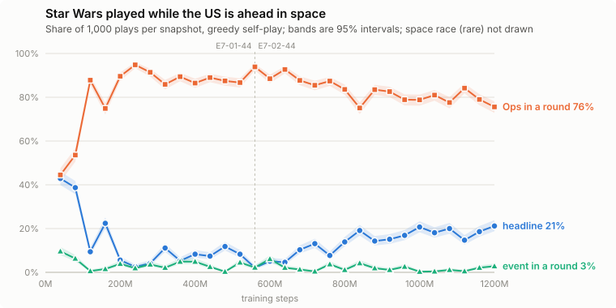

# Star Wars when the US is ahead in space: event or Ops, across E7-02-44 (2026-10-03)

Owner: for E7-02-44, at 40M snapshot intervals, how often the US, ahead in space with Star Wars in
hand, plays it for the event versus for Ops. Follow-up: per snapshot, play until there are 1,000
such plays, split into headline / Ops in an action round / event in an action round, with a plot.

Star Wars (US, 2 Ops, Late War): if the US is ahead on the Space Race Track, the US takes any
non-scoring card from the discard pile and plays it as an event. Level or behind, the event does
nothing; the engine offers EVENT in a round only when the US is ahead, which the probe confirms.

**Method.** `tools/scripts/star_wars_play.py --target-plays 1000`: greedy self-play of each
snapshot in rounds of 4,096 games on fresh seeds (from seed 57,000) until there are at least 1,000
plays while ahead, then exactly the first 1,000 in game order (8,209-15,268 games per snapshot).
The snapshot nearest each 40M mark; E7-02-44 is E7-01-44 continued from 560M, so the marks to
560M are E7-01-44's snapshots (the same lineage). A *play* is the US selecting Star Wars at its own
card choice: a headline (its event), or an action round followed by the play mode -- EVENT, SPACE
(space race), or Ops (influence, coup or realign). "Ahead" is the US space marker strictly above
the USSR's at that choice. A selection at a card choice that was not a play (not followed by Star
Wars' play mode -- 2 in a 2,048-game check) is set aside. Dumps:
`data/eval/star_wars/E7-02-44_1000/<snapshot>.json`; the plot is drawn from them
(`--load --plot-svg ... --branch-at 560`).

## Result

Each row is 1,000 plays while ahead (95% interval about ±3 points at 20%, ±2 at 5%):

| snapshot | games played | plays while ahead | headline | Ops in a round | event in a round | space race |
|:---|---:|---:|---:|---:|---:|---:|
| 40M (E7-01) | 10,154 | 1,000 | 429 (42.9%) | 445 (44.5%) | 96 (9.6%) | 30 (3.0%) |
| 80M (E7-01) | 8,575 | 1,000 | 387 (38.7%) | 536 (53.6%) | 63 (6.3%) | 14 (1.4%) |
| 120M (E7-01) | 15,268 | 1,000 | 94 (9.4%) | 878 (87.8%) | 6 (0.6%) | 22 (2.2%) |
| 160M (E7-01) | 9,847 | 1,000 | 224 (22.4%) | 749 (74.9%) | 15 (1.5%) | 12 (1.2%) |
| 200M (E7-01) | 13,108 | 1,000 | 56 (5.6%) | 896 (89.6%) | 39 (3.9%) | 9 (0.9%) |
| 240M (E7-01) | 9,829 | 1,000 | 25 (2.5%) | 948 (94.8%) | 19 (1.9%) | 8 (0.8%) |
| 280M (E7-01) | 10,161 | 1,000 | 41 (4.1%) | 914 (91.4%) | 36 (3.6%) | 9 (0.9%) |
| 320M (E7-01) | 12,698 | 1,000 | 111 (11.1%) | 859 (85.9%) | 21 (2.1%) | 9 (0.9%) |
| 360M (E7-01) | 10,708 | 1,000 | 53 (5.3%) | 894 (89.4%) | 49 (4.9%) | 4 (0.4%) |
| 400M (E7-01) | 11,181 | 1,000 | 83 (8.3%) | 865 (86.5%) | 49 (4.9%) | 3 (0.3%) |
| 440M (E7-01) | 9,355 | 1,000 | 74 (7.4%) | 890 (89.0%) | 25 (2.5%) | 11 (1.1%) |
| 480M (E7-01) | 8,396 | 1,000 | 118 (11.8%) | 875 (87.5%) | 3 (0.3%) | 4 (0.4%) |
| 520M (E7-01) | 11,544 | 1,000 | 83 (8.3%) | 867 (86.7%) | 45 (4.5%) | 5 (0.5%) |
| 560M (E7-01) | 9,118 | 1,000 | 21 (2.1%) | 939 (93.9%) | 22 (2.2%) | 18 (1.8%) |
| 600M | 9,276 | 1,000 | 51 (5.1%) | 885 (88.5%) | 61 (6.1%) | 3 (0.3%) |
| 640M | 11,065 | 1,000 | 46 (4.6%) | 927 (92.7%) | 21 (2.1%) | 6 (0.6%) |
| 680M | 10,846 | 1,000 | 103 (10.3%) | 877 (87.7%) | 13 (1.3%) | 7 (0.7%) |
| 720M | 9,969 | 1,000 | 131 (13.1%) | 855 (85.5%) | 4 (0.4%) | 10 (1.0%) |
| 760M | 11,506 | 1,000 | 77 (7.7%) | 874 (87.4%) | 37 (3.7%) | 12 (1.2%) |
| 800M | 9,385 | 1,000 | 139 (13.9%) | 836 (83.6%) | 11 (1.1%) | 14 (1.4%) |
| 840M | 9,502 | 1,000 | 191 (19.1%) | 751 (75.1%) | 42 (4.2%) | 16 (1.6%) |
| 880M | 9,854 | 1,000 | 143 (14.3%) | 835 (83.5%) | 19 (1.9%) | 3 (0.3%) |
| 920M | 10,354 | 1,000 | 151 (15.1%) | 826 (82.6%) | 11 (1.1%) | 12 (1.2%) |
| 960M | 9,256 | 1,000 | 169 (16.9%) | 789 (78.9%) | 26 (2.6%) | 16 (1.6%) |
| 1000M | 9,399 | 1,000 | 207 (20.7%) | 788 (78.8%) | 3 (0.3%) | 2 (0.2%) |
| 1040M | 9,535 | 1,000 | 181 (18.1%) | 810 (81.0%) | 4 (0.4%) | 5 (0.5%) |
| 1080M | 8,209 | 1,000 | 200 (20.0%) | 776 (77.6%) | 11 (1.1%) | 13 (1.3%) |
| 1120M | 8,371 | 1,000 | 147 (14.7%) | 842 (84.2%) | 5 (0.5%) | 6 (0.6%) |
| 1160M | 10,424 | 1,000 | 186 (18.6%) | 790 (79.0%) | 21 (2.1%) | 3 (0.3%) |
| 1200M | 11,259 | 1,000 | 212 (21.2%) | 756 (75.6%) | 28 (2.8%) | 4 (0.4%) |

How often a play of Star Wars is a headline, by space position at the choice (all plays in the
same games; the event works only when ahead):

| snapshot | ahead | level | behind |
|:---|---:|---:|---:|
| 40M (E7-01) | 43% (429/1000) | 46% (150/326) | 46% (219/471) |
| 80M (E7-01) | 39% (387/1000) | 38% (121/318) | 41% (219/533) |
| 120M (E7-01) | 9% (94/1000) | 8% (30/378) | 10% (81/799) |
| 160M (E7-01) | 22% (224/1000) | 24% (95/395) | 22% (153/687) |
| 200M (E7-01) | 6% (56/1000) | 4% (20/522) | 4% (47/1283) |
| 240M (E7-01) | 2% (25/1000) | 2% (8/398) | 3% (24/767) |
| 280M (E7-01) | 4% (41/1000) | 3% (10/380) | 3% (28/954) |
| 320M (E7-01) | 11% (111/1000) | 7% (33/469) | 7% (73/984) |
| 360M (E7-01) | 5% (53/1000) | 6% (21/379) | 5% (39/723) |
| 400M (E7-01) | 8% (83/1000) | 8% (33/428) | 7% (66/910) |
| 440M (E7-01) | 7% (74/1000) | 6% (25/387) | 7% (45/653) |
| 480M (E7-01) | 12% (118/1000) | 14% (46/338) | 9% (57/661) |
| 520M (E7-01) | 8% (83/1000) | 7% (35/489) | 7% (65/971) |
| 560M (E7-01) | 2% (21/1000) | 2% (6/390) | 0% (2/789) |
| 600M | 5% (51/1000) | 5% (17/366) | 6% (40/681) |
| 640M | 5% (46/1000) | 5% (24/471) | 4% (49/1155) |
| 680M | 10% (103/1000) | 11% (47/434) | 9% (81/885) |
| 720M | 13% (131/1000) | 14% (56/400) | 13% (109/817) |
| 760M | 8% (77/1000) | 7% (32/428) | 8% (74/883) |
| 800M | 14% (139/1000) | 12% (53/433) | 13% (99/762) |
| 840M | 19% (191/1000) | 18% (63/358) | 17% (132/788) |
| 880M | 14% (143/1000) | 11% (43/391) | 10% (82/827) |
| 920M | 15% (151/1000) | 14% (61/431) | 11% (83/753) |
| 960M | 17% (169/1000) | 14% (56/394) | 15% (118/790) |
| 1000M | 21% (207/1000) | 17% (57/341) | 16% (114/720) |
| 1040M | 18% (181/1000) | 20% (71/352) | 15% (107/724) |
| 1080M | 20% (200/1000) | 19% (65/335) | 16% (83/522) |
| 1120M | 15% (147/1000) | 11% (31/274) | 11% (63/581) |
| 1160M | 19% (186/1000) | 18% (70/393) | 18% (150/830) |
| 1200M | 21% (212/1000) | 18% (82/467) | 15% (149/985) |

Pooled by period, headline rate ahead vs not ahead (level and behind together):

| period | ahead | level | behind | ahead − not ahead |
|:---|---:|---:|---:|---:|
| 40-80M | 40.8% | 42.1% | 43.6% | −2.2 pp (±3.2) |
| 120-840M | 9.1% | 8.3% | 7.8% | +1.1 pp (±0.5) |
| 880-1,200M | 17.7% | 15.9% | 14.1% | +3.0 pp (±1.0) |

**Reading.**

* **Ahead in space, the US mostly plays Star Wars for Ops in a round**: 75-95% of plays from 120M
  on (76% at 1,200M). The early snapshots split it (40M: 43% headline, 45% Ops, 10% event in a
  round).
* **The event, when it is used, is almost always the headline.** Choosing EVENT over Ops in an
  action round is 0.3-6% at every snapshot after 80M (2.8% at 1,200M). The space race is ≤ 3%.
* **The headline share falls to 2-12% through 200-640M, then climbs in E7-02-44's own range** to
  14-21% from 840M (21% at 1,200M).
* **That climb is not the event being valued.** The headline rate is almost the same whether the
  US is ahead, level or behind -- and only when ahead does the event do anything. The gap opens
  only late, and stays small: +3.0 points (17.7% vs 14.6%) pooled over 880-1,200M, +1.1 over
  120-840M, none at 40-80M. So most of the rise is the policy headlining Star Wars more as such --
  a weak 2-Ops US card whose headline costs no action round -- with a faint, late preference for
  doing so when the event works. At 1,200M, 231 of 1,452 plays while not ahead (16%) are headlines
  that do nothing.
* The first, 4,096-game-per-snapshot version of this probe (same seeds for the first 4,096 games)
  gave the same picture, and found about 10% of "ahead" holdings never played by the US (game
  end, or discarded or taken by other events).

## What Star Wars retrieves (follow-up)

Owner: check also what events the US chooses to retrieve when it plays Star Wars.

**Method.** The same 30 runs replayed with the pick recorded (same seeds: the per-snapshot table
above is reproduced exactly; dumps `data/eval/star_wars/E7-02-44_1000r/`). Star Wars' event is one
mandatory US card choice; its legal options are the non-scoring cards in the discard pile whose
event can trigger for the US (`ActionMask`), 22-30 on average. Retrievals are split by how the
event fired: **the US played Star Wars** (its headline or event in a round -- 84% of them
headlines); **the USSR played Star Wars** (for Ops in a round, or headlined it), which fires the US
event all the same; and 39 where it fired inside another event (Missile Envy handing Star Wars to
the US), left out. Every US play while ahead is accounted for: 4,886 retrievals, plus 52 plays
whose event did not get to the pick -- the two traced were a game ending in the headline before
Star Wars resolved (USSR's Glasnost at −19 VP), and an empty discard pile right after the
reshuffle, where the event fizzles by the rules.

**US plays Star Wars** -- share of the picks:

| card | 40-80M | 120-840M | 880-1,200M | 1,200M |
|:---|---:|---:|---:|---:|
| Junta | 42% | 10% | 3% | 2% |
| UN Intervention | 12% | 22% | 12% | 7% |
| Red Scare/Purge | 12% | 12% | 40% | 53% |
| How I Learned to Stop Worrying | 0% | 5% | 4% | 2% |
| Duck and Cover | 6% | 3% | 1% | 1% |
| Grain Sales to Soviets | 1% | 3% | 3% | 1% |
| ABM Treaty | 4% | 5% | 5% | 7% |
| SALT Negotiations | 1% | 5% | 5% | 3% |
| any USSR card | 6% | 8% | 6% | 8% |
| retrievals | 972 | 2,214 | 1,700 | 238 |

**USSR plays Star Wars (US event fires)** -- share of the picks:

| card | 40-80M | 120-840M | 880-1,200M | 1,200M |
|:---|---:|---:|---:|---:|
| Junta | 51% | 21% | 5% | 1% |
| UN Intervention | 3% | 27% | 13% | 6% |
| Red Scare/Purge | 1% | 1% | 3% | 3% |
| How I Learned to Stop Worrying | 0% | 15% | 35% | 40% |
| Duck and Cover | 22% | 11% | 17% | 22% |
| Grain Sales to Soviets | 9% | 8% | 9% | 8% |
| ABM Treaty | 0% | 1% | 0% | 0% |
| SALT Negotiations | 0% | 1% | 0% | 0% |
| any USSR card | 1% | 3% | 2% | 3% |
| retrievals | 711 | 4,590 | 1,247 | 121 |

**Reading.**

* **What the US takes moves with training.** Early (40-80M) it is Junta (42% of picks); through
  120-840M UN Intervention leads (22%) with Junta and Red Scare/Purge behind; from 880M **Red
  Scare/Purge** takes over -- 40% of picks over 880-1,200M, 53% at 1,200M, where it is taken in
  77% of the retrievals that offer it. Since most of these plays are headlines, that is the
  opponent's Ops at −1 for the whole turn.
* **When the USSR plays Star Wars, the US picks differently**: How I Learned to Stop Worrying
  (35-40% from 880M) and Duck and Cover (17-22%), Grain Sales (~8%); Red Scare/Purge only 1-3%.
  These retrievals happen in the USSR's action rounds, mid-turn, so part of the difference is
  timing, not only preference.
* **About 7% of the US's own retrievals take a USSR card** (346 of 4,886), steady across training:
  "We Will Bury You" (85), "Lone Gunman" (79), Ortega Elected in Nicaragua (29), Muslim
  Revolution (26), Liberation Theology (23), OPEC (14) and others. By their text these events
  help the USSR (We Will Bury You: DEFCON −1 and 3 VP to the USSR unless UN Intervention follows;
  Lone Gunman: the USSR conducts Operations). Candidate mistakes, not checked further here.

**Example: Lone Gunman through Star Wars** (owner: find an example replay). Game 942 of the
1,200M snapshot's run, reproduced exactly from its seed (the batch runner seeds env `i` with
`base_seed + 10007·i + 1`; here 9,483,595) with a greedy replay:

    PYTHONPATH=.:build/release python tools/play_match.py \
      --agent data/checkpoints/E7-02-44_20260930_222159/snapshot_1200029696steps.pt \
      --seed 9483595 --temperature 0.0001 --game-id E7-02-44_1200M_star_wars_lone_gunman_s9483595 \
      --output data/replays/E7-02-44_1200M_star_wars_lone_gunman_s9483595.tslog.json

Turn 8 headline, VP +4: the USSR headlines ABM Treaty, the US Star Wars (US space ahead). ABM
Treaty resolves first (4 Ops: DEFCON 3 → 4, then a successful USSR coup in Mexico, DEFCON 4 → 3).
Star Wars then offers 14 cards; the policy takes **Lone Gunman at p = 0.89** (How I Learned to
Stop Worrying 0.07, Nuclear Test Ban 0.02, Red Scare/Purge 0.02) -- step 449 of the replay. Lone
Gunman reveals the US hand and gives the USSR 1 Op, which it spends on a coup in Venezuela: it
fails (3 + 1 vs 4), but DEFCON drops to 2 for the turn and USSR military ops rise to 5. The US
critic reads the pick itself as neutral (0.723 → 0.734) and drops to 0.669 once the coup has
happened. The US still wins on turn 9 (Europe Control).

Five more of the 1,200M games, generated the same way (owner: find a few more), each named
`data/replays/E7-02-44_1200M_star_wars_lone_gunman_s<seed>.tslog.json`:

| seed | step | when | VP | options | p(Lone Gunman) | the USSR's 1 Op | critic (US): before pick → after pick → after the Op | result |
|---:|---:|:---|---:|---:|---:|:---|:---|:---|
| 9483595 | 449 | T8 headline | +4 | 14 | 0.89 | coup Venezuela, fails | 0.723 → 0.734 → 0.669 | US, T9, Europe Control |
| 9004283 | 425 | T8 AR1 | −3 | 13 | 1.00 | coup Brazil, +1 | −0.064 → −0.005 → −0.155 | USSR, final scoring (−11) |
| 9843847 | 533 | T10 headline | −4 | 35 | 0.91 | coup Venezuela, +1 | −0.779 → −0.655 → −0.802 | USSR, T11, 20 VP |
| 129098 | 434 | T8 headline | +7 | 17 | 1.00 | coup Brazil, fails | 0.816 → 0.820 → 0.762 | US, T10, 20 VP |
| 187325 | 491 | T9 headline | −6 | 23 | 1.00 | coup Zaire, +3 | −0.696 → −0.621 → −0.671 | USSR, T11, 20 VP |
| 6776818 | 568 | T10 headline | +3 | 36 | 1.00 | coup Zaire, +1 | −0.457 → −0.335 → −0.476 | US, final scoring (+12) |

In all six the USSR spends the Op on a coup at DEFCON 3, so DEFCON goes to 2 for the turn and
USSR military ops rise. The policy is near-certain of the pick (0.89-1.00), and the critic reads
the pick itself as a gain for the US (+0.004 to +0.12) and gives it back once the USSR has
couped (−0.05 to −0.15): the network does not seem to anticipate what the USSR does with the Op.
The one benefit seen is NORAD in the action-round case (9004283): DEFCON moved to 2 during the
round with Canada US-controlled, so the US added 1 influence (Panama). NORAD was active in two of
the headline games as well, but it pays only at the end of an action round. Other 1,200M seeds
with the same pick, not generated: 2300617, 7597392, 4566295, 595564, 7122176.

### Detail: the top 10 picks per period

"Offered in" is the share of retrievals where the card was a legal option; "picked when offered"
is how often it was taken then.

#### Star Wars retrievals, 40-80M: the US played Star Wars (headline or event in a round)

972 retrievals, 22.4 legal options on average.

| card | side | picked | share of picks | offered in | picked when offered |
|:---|:---|---:|---:|---:|---:|
| Junta | neutral | 410 | 42.2% | 50% | 84% |
| UN Intervention | neutral | 120 | 12.3% | 47% | 26% |
| Red Scare/Purge | neutral | 115 | 11.8% | 52% | 23% |
| Duck and Cover | us | 59 | 6.1% | 45% | 14% |
| ABM Treaty | neutral | 39 | 4.0% | 54% | 7% |
| Missile Envy | neutral | 30 | 3.1% | 51% | 6% |
| The Voice of America | us | 24 | 2.5% | 47% | 5% |
| Nuclear Test Ban | neutral | 22 | 2.3% | 42% | 5% |
| “We Will Bury You” | ussr | 18 | 1.9% | 32% | 6% |
| SALT Negotiations | neutral | 12 | 1.2% | 43% | 3% |
| 30 other cards | | 123 | 12.7% | | |

By the side of the card taken: neutral 81%, us 14%, ussr 6%. Not counted: 9 retrievals where the US event fired inside another event (Star Wars handed over to the US by an event such as Missile Envy).

#### Star Wars retrievals, 40-80M: the USSR played Star Wars, firing the US event

711 retrievals, 27.2 legal options on average.

| card | side | picked | share of picks | offered in | picked when offered |
|:---|:---|---:|---:|---:|---:|
| Junta | neutral | 361 | 50.8% | 64% | 80% |
| Duck and Cover | us | 159 | 22.4% | 50% | 44% |
| Grain Sales to Soviets | us | 61 | 8.6% | 39% | 22% |
| Soviets Shoot Down KAL-007 | us | 28 | 3.9% | 16% | 25% |
| UN Intervention | neutral | 23 | 3.2% | 46% | 7% |
| Missile Envy | neutral | 17 | 2.4% | 56% | 4% |
| The Voice of America | us | 11 | 1.5% | 61% | 3% |
| Tear Down this Wall | us | 11 | 1.5% | 23% | 7% |
| Red Scare/Purge | neutral | 10 | 1.4% | 58% | 2% |
| Colonial Rear Guards | us | 4 | 0.6% | 59% | 1% |
| 18 other cards | | 26 | 3.7% | | |

By the side of the card taken: neutral 59%, us 41%, ussr 1%.

#### Star Wars retrievals, 120-840M: the US played Star Wars (headline or event in a round)

2,214 retrievals, 24.2 legal options on average.

| card | side | picked | share of picks | offered in | picked when offered |
|:---|:---|---:|---:|---:|---:|
| UN Intervention | neutral | 485 | 21.9% | 47% | 47% |
| Red Scare/Purge | neutral | 265 | 12.0% | 58% | 21% |
| Junta | neutral | 222 | 10.0% | 54% | 19% |
| SALT Negotiations | neutral | 111 | 5.0% | 42% | 12% |
| ABM Treaty | neutral | 108 | 4.9% | 60% | 8% |
| How I Learned to Stop Worrying | neutral | 105 | 4.7% | 48% | 10% |
| Nuclear Test Ban | neutral | 87 | 3.9% | 46% | 9% |
| Brush War | neutral | 72 | 3.3% | 58% | 6% |
| Duck and Cover | us | 71 | 3.2% | 48% | 7% |
| Grain Sales to Soviets | us | 60 | 2.7% | 50% | 5% |
| 65 other cards | | 628 | 28.4% | | |

By the side of the card taken: neutral 73%, us 19%, ussr 8%. Not counted: 28 retrievals where the US event fired inside another event (Star Wars handed over to the US by an event such as Missile Envy).

#### Star Wars retrievals, 120-840M: the USSR played Star Wars, firing the US event

4,590 retrievals, 27.2 legal options on average.

| card | side | picked | share of picks | offered in | picked when offered |
|:---|:---|---:|---:|---:|---:|
| UN Intervention | neutral | 1,262 | 27.5% | 50% | 55% |
| Junta | neutral | 953 | 20.8% | 60% | 35% |
| How I Learned to Stop Worrying | neutral | 684 | 14.9% | 50% | 30% |
| Duck and Cover | us | 495 | 10.8% | 52% | 21% |
| Grain Sales to Soviets | us | 367 | 8.0% | 50% | 16% |
| Soviets Shoot Down KAL-007 | us | 98 | 2.1% | 28% | 8% |
| Tear Down this Wall | us | 90 | 2.0% | 27% | 7% |
| Missile Envy | neutral | 75 | 1.6% | 57% | 3% |
| “We Will Bury You” | ussr | 70 | 1.5% | 52% | 3% |
| Red Scare/Purge | neutral | 55 | 1.2% | 64% | 2% |
| 57 other cards | | 441 | 9.6% | | |

By the side of the card taken: neutral 70%, us 27%, ussr 3%.

#### Star Wars retrievals, 880-1,200M: the US played Star Wars (headline or event in a round)

1,700 retrievals, 26.1 legal options on average.

| card | side | picked | share of picks | offered in | picked when offered |
|:---|:---|---:|---:|---:|---:|
| Red Scare/Purge | neutral | 672 | 39.5% | 64% | 62% |
| UN Intervention | neutral | 205 | 12.1% | 48% | 25% |
| Missile Envy | neutral | 83 | 4.9% | 58% | 8% |
| ABM Treaty | neutral | 82 | 4.8% | 63% | 8% |
| SALT Negotiations | neutral | 82 | 4.8% | 42% | 12% |
| How I Learned to Stop Worrying | neutral | 68 | 4.0% | 54% | 7% |
| Grain Sales to Soviets | us | 51 | 3.0% | 54% | 6% |
| Junta | neutral | 46 | 2.7% | 56% | 5% |
| “Lone Gunman” | ussr | 32 | 1.9% | 31% | 6% |
| Nuclear Test Ban | neutral | 31 | 1.8% | 49% | 4% |
| 59 other cards | | 348 | 20.5% | | |

By the side of the card taken: neutral 80%, us 14%, ussr 6%. Not counted: 2 retrievals where the US event fired inside another event (Star Wars handed over to the US by an event such as Missile Envy).

#### Star Wars retrievals, 880-1,200M: the USSR played Star Wars, firing the US event

1,247 retrievals, 28.0 legal options on average.

| card | side | picked | share of picks | offered in | picked when offered |
|:---|:---|---:|---:|---:|---:|
| How I Learned to Stop Worrying | neutral | 441 | 35.4% | 53% | 67% |
| Duck and Cover | us | 211 | 16.9% | 53% | 32% |
| UN Intervention | neutral | 162 | 13.0% | 50% | 26% |
| Grain Sales to Soviets | us | 111 | 8.9% | 49% | 18% |
| Junta | neutral | 58 | 4.7% | 60% | 8% |
| Tear Down this Wall | us | 39 | 3.1% | 26% | 12% |
| Red Scare/Purge | neutral | 34 | 2.7% | 66% | 4% |
| Soviets Shoot Down KAL-007 | us | 32 | 2.6% | 31% | 8% |
| Arms Race | neutral | 20 | 1.6% | 58% | 3% |
| Missile Envy | neutral | 15 | 1.2% | 58% | 2% |
| 40 other cards | | 124 | 9.9% | | |

By the side of the card taken: neutral 62%, us 36%, ussr 2%.

#### Star Wars retrievals, 1,200M: the US played Star Wars (headline or event in a round)

238 retrievals, 28.4 legal options on average.

| card | side | picked | share of picks | offered in | picked when offered |
|:---|:---|---:|---:|---:|---:|
| Red Scare/Purge | neutral | 127 | 53.4% | 69% | 77% |
| UN Intervention | neutral | 17 | 7.1% | 47% | 15% |
| ABM Treaty | neutral | 17 | 7.1% | 66% | 11% |
| Brush War | neutral | 11 | 4.6% | 63% | 7% |
| “Lone Gunman” | ussr | 11 | 4.6% | 29% | 16% |
| Nuclear Test Ban | neutral | 10 | 4.2% | 58% | 7% |
| SALT Negotiations | neutral | 7 | 2.9% | 42% | 7% |
| Junta | neutral | 4 | 1.7% | 59% | 3% |
| How I Learned to Stop Worrying | neutral | 4 | 1.7% | 60% | 3% |
| Grain Sales to Soviets | us | 3 | 1.3% | 56% | 2% |
| 19 other cards | | 27 | 11.3% | | |

By the side of the card taken: neutral 86%, ussr 8%, us 6%. Not counted: 0 retrievals where the US event fired inside another event (Star Wars handed over to the US by an event such as Missile Envy).

#### Star Wars retrievals, 1,200M: the USSR played Star Wars, firing the US event

121 retrievals, 29.8 legal options on average.

| card | side | picked | share of picks | offered in | picked when offered |
|:---|:---|---:|---:|---:|---:|
| How I Learned to Stop Worrying | neutral | 48 | 39.7% | 60% | 67% |
| Duck and Cover | us | 27 | 22.3% | 59% | 38% |
| Grain Sales to Soviets | us | 10 | 8.3% | 59% | 14% |
| UN Intervention | neutral | 7 | 5.8% | 56% | 10% |
| Tear Down this Wall | us | 4 | 3.3% | 29% | 11% |
| Red Scare/Purge | neutral | 4 | 3.3% | 69% | 5% |
| Soviets Shoot Down KAL-007 | us | 4 | 3.3% | 36% | 9% |
| Nuclear Test Ban | neutral | 3 | 2.5% | 68% | 4% |
| The Voice of America | us | 2 | 1.7% | 55% | 3% |
| “Lone Gunman” | ussr | 2 | 1.7% | 33% | 5% |
| 10 other cards | | 10 | 8.3% | | |

By the side of the card taken: neutral 55%, us 42%, ussr 3%.

**Not measured here:** whether the event would be worth more than the Ops in these positions. That
depends on what is in the discard pile, and needs a counterfactual (play the event on a copy and
compare the value head or game results). That is the natural next step if the owner wants it.
